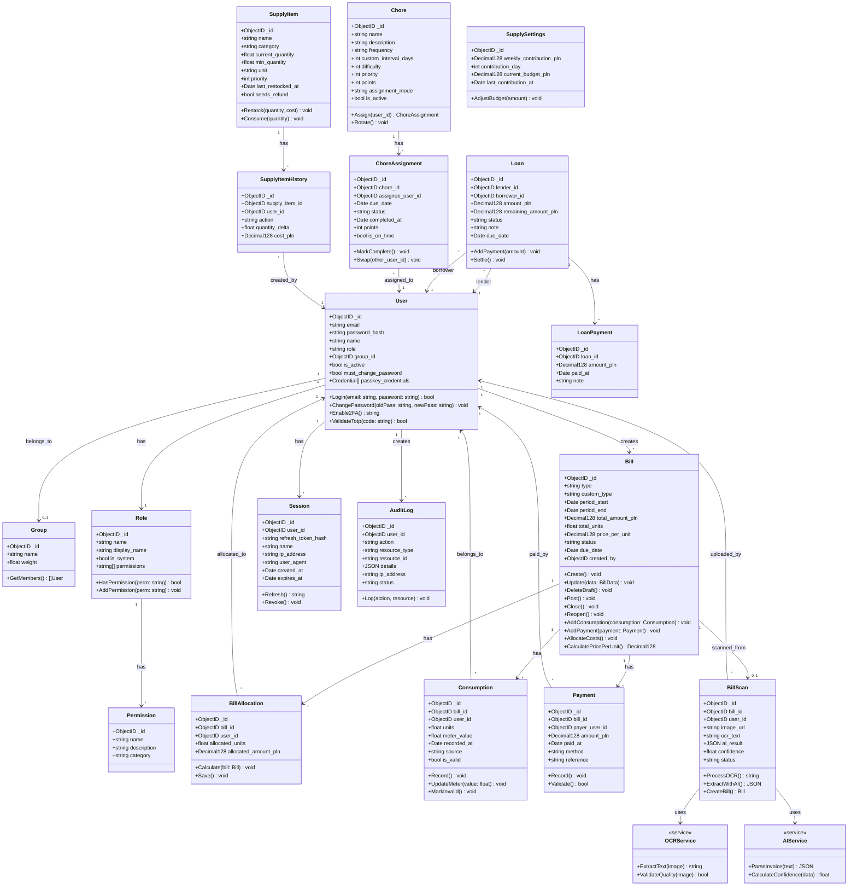
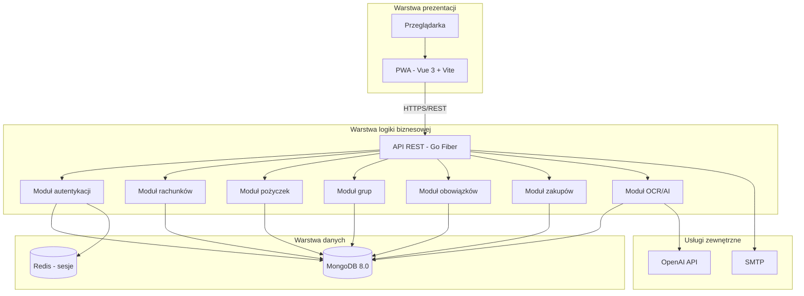
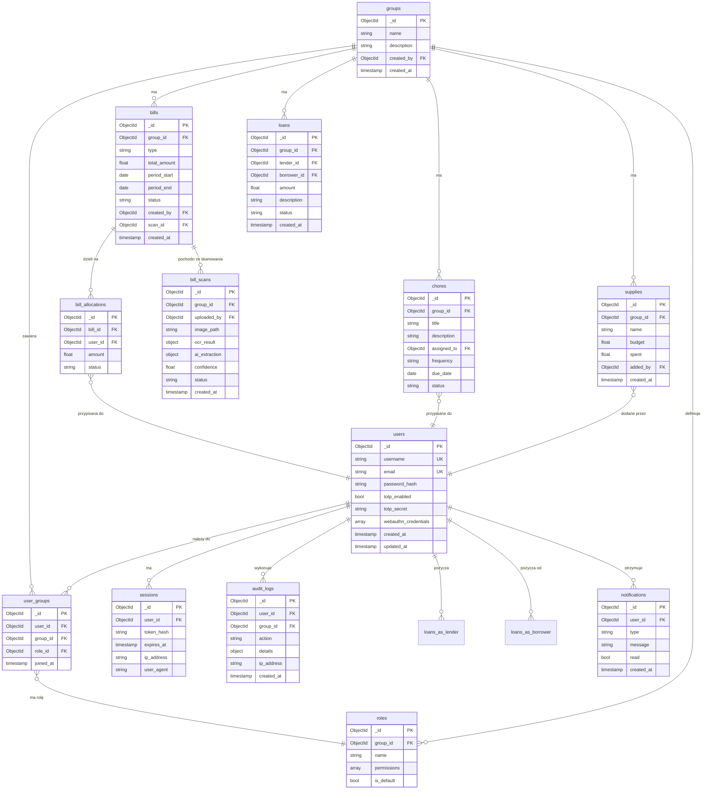
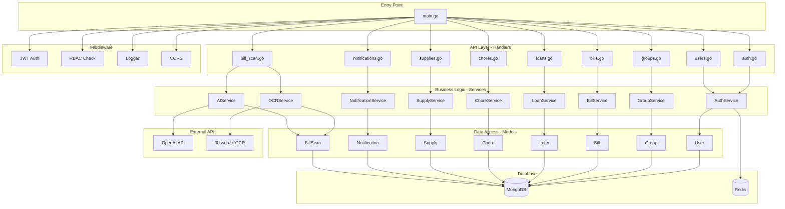
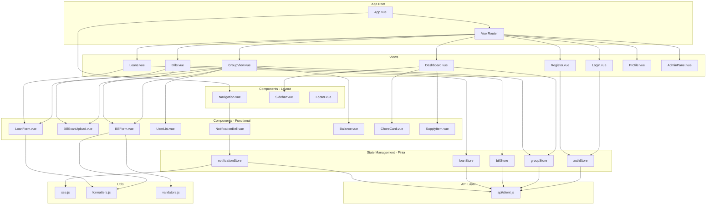
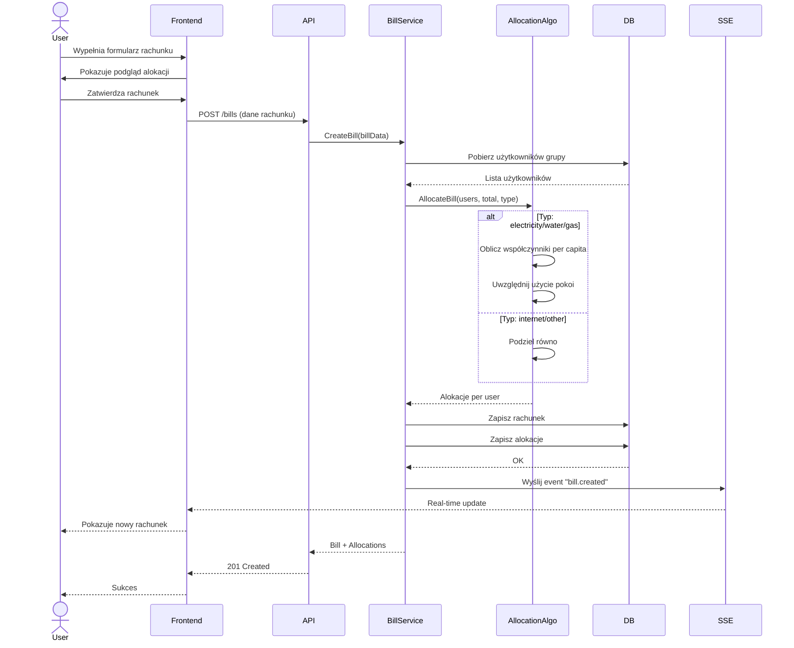
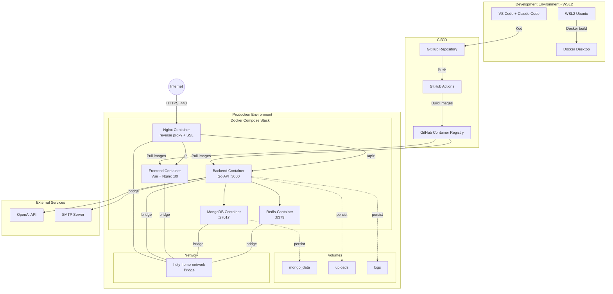

9# DOKUMENTACJA TECHNICZNA
## Aplikacja Holy Home - System zarządzania domowym budżetem

**Autor:** Sainaif
**Data utworzenia:** 30 września 2025
**Ostatnia aktualizacja:** 30 października 2025
**Wersja:** 2.0 (z diagramami Mermaid + moduł OCR/AI)

---

## 1. WSTĘP

### 1.1. Cel aplikacji

Holy Home to aplikacja webowa stworzona do zarządzania finansami i obowiązkami w współdzielonych mieszkaniach lub domach. Głównym celem jest uproszczenie rozliczeń rachunków, śledzenia pożyczek i koordynacji obowiązków domowych między współlokatorami.

### 1.2. Zakres funkcjonalny

Aplikacja rozwiązuje następujące problemy:
- Rozliczanie rachunków za media (prąd, gaz, internet) z uwzględnieniem indywidualnego i wspólnego zużycia
- **Automatyczne skanowanie faktur** - rozpoznawanie danych z faktur za pomocą OCR i AI (bez używania klawiatury)
- Śledzenie pożyczek między współlokatorami i automatyczne kompensowanie długów
- Zarządzanie domowymi zakupami i wspólnym budżetem
- Planowanie i przydzielanie obowiązków domowych
- Prowadzenie historii finansowej i audytu działań

### 1.3. Kontekst powstania

Projekt powstał w odpowiedzi na praktyczną potrzebę współdzielonego gospodarstwa domowego. Aplikacja została zaprojektowana jako samoobsługowe rozwiązanie (self-hosted), działające w środowisku Docker, co zapewnia pełną kontrolę nad danymi i niezależność od usług zewnętrznych.

---

## 2. PROCES ROZWOJU

### 2.1. Harmonogram projektu

**Okres realizacji:** 30 września - 25 października 2025 (26 dni)

**Fazy rozwoju:**

| Faza | Daty | Opis |
|------|------|------|
| Inicjalizacja | 30.09 - 03.10 | Podstawowa struktura, autentykacja, CRUD użytkowników |
| System rachunków | 03.10 - 04.10 | Automatyczna alokacja kosztów, odczyty liczników |
| Uprawnienia | 04.10 | System ról i kontrola dostępu |
| Pożyczki i bilans | 08.10 | Zarządzanie długami, płatności |
| Dokumentacja | 23.10 | Komentarze w kodzie |
| Zaawansowane funkcje | 24.10 - 25.10 | Kompensacja długów, netting tranzytywny, CI/CD |

### 2.2. Metodyka pracy

Projekt był rozwijany w sposób iteracyjny z następującymi zasadami:
- Określono zbiór podstawowych wymagań funkcjonalnych na początku
- Funkcjonalności były dodawane i modyfikowane w reakcji na potrzeby i feedback użytkowników
- Dokumentacja powstawała głównie w formie komentarzy w kodzie i commitów Git
- Błędy były naprawiane na bieżąco w miarę ich wykrywania

### 2.3. Narzędzia wspomagające rozwój

W procesie developmentu wykorzystano:
- **Claude Code** - asystent AI wspomagający pisanie kodu i rozwiązywanie problemów
- **Git** - kontrola wersji z dokładną historią zmian
- **Docker** - konteneryzacja i testowanie lokalnie w WSL (Windows Subsystem for Linux)
- **GitHub Container Registry (GHCR)** - hosting obrazów Docker

### 2.4. Historia commitów

**Faza 1: Inicjalizacja (30.09 - 03.10)**
- 30.09: Initial commit, podstawowa struktura projektu
- 30.09 - 01.10: Seria commitów "working a bit", "working somewhat", "works like 90%" - iteracyjna implementacja podstawowych funkcji autentykacji i zarządzania użytkownikami
- 02.10: "working 1/2", "working" - kontynuacja rozwoju systemu użytkowników i grup
- 03.10: "fully works", "works decently well", "works better", "works even better", "works" - stabilizacja kodu i naprawa błędów

**Faza 2: System alokacji rachunków (03.10 - 04.10)**
- 03.10: `feat: implement allocation service for bill cost distribution` - implementacja automatycznego rozdzielania kosztów rachunków
- 04.10: Seria commitów "works", "w", "WORKS FULLY FINALLY NO NOTIFICATIONS FUCK IT THO" - finalizacja i debugowanie systemu

**Faza 3: Uprawnienia i płatności (04.10)**
- Dodanie pobierania statusu płatności rachunków
- Aktualizacja kontroli uprawnień w trasach
- Rozszerzenie serwisu alokacji kosztów
- Poprawa listingu szablonów cyklicznych rachunków
- Implementacja kontroli uprawnień w trasach pożyczek
- Modyfikacja widoku bilansu i szczegółów rachunku

**Faza 4: System pożyczek (08.10)**
- Aktualizacja endpointu pożyczek z sortowaniem i paginacją
- Rozszerzenie widoku Balance.vue o nazwy użytkowników i grup
- Dodanie kontrolek sortowania i paginacji
- Implementacja pobierania płatności pożyczek
- Rozszerzenie wyświetlania pożyczek z rozwijanymi wierszami
- Poprawa wyświetlania statusu płatności w BillDetail.vue

**Faza 5: Dokumentacja kodu (23.10)**
- 2 commity: "3/4 done, added comments" - dodanie komentarzy wyjaśniających w kodzie źródłowym

**Faza 6: Zaawansowane funkcje (24.10 - 25.10)**
- 24.10: Implementacja tranzytywnego nettingu długów dla grup
- 24.10: Naprawa błędu braku długów wewnątrz grupy (wspólny budżet)
- 24.10: Dodanie dokumentacji code review
- 24.10: Naprawa krytycznych bugów w algorytmie nettingu
- 24.10: Dodanie CI/CD pipeline z GitHub Actions
- 24.10: Narzędzia do sprawdzania statusu workflow
- 24.10: Automatyczne formatowanie kodu (gofmt)
- 25.10: Naprawa wersji Go (1.24.4 → 1.23)
- 25.10: Uproszczenie konfiguracji CI/CD
- 25.10: Implementacja kompensacji długów grupowych
- 25.10: Usunięcie starych skryptów testowych

### 2.5. Wnioski z procesu rozwoju

- Iteracyjne podejście pozwoliło na szybkie reagowanie na rzeczywiste potrzeby użytkowników
- Wykorzystanie asystenta AI (Claude Code) znacząco przyśpieszyło implementację złożonych algorytmów (np. kompensacja długów)
- Historia commitów odzwierciedla naturalny proces rozwoju - od podstawowej funkcjonalności do zaawansowanych feature'ów
- Brak testów automatycznych był świadomym kompromisem dla przyspieszenia dostarczenia MVP

---

## 3. ARCHITEKTURA SYSTEMU

### 3.1. Przegląd ogólny

Holy Home wykorzystuje klasyczną architekturę 3-warstwową:
- **Warstwa prezentacji:** Frontend (Vue.js 3)
- **Warstwa logiki:** Backend (Go + Fiber)
- **Warstwa danych:** Baza danych (MongoDB)

**Diagram architektury:** Zobacz plik `diagram_architektura.xml`

### 3.2. Stack technologiczny

#### Backend:
- **Język:** Go 1.23 (wcześniej 1.24.4, zmieniono dla kompatybilności CI/CD)
- **Framework HTTP:** Fiber v2.52.9 (wysokowydajny framework inspirowany Express.js)
- **Baza danych:** MongoDB 8.0 (NoSQL, elastyczne schematy)
- **Autentykacja:**
  - JWT (JSON Web Tokens) - golang-jwt/jwt v5.3.0
  - TOTP (Time-based One-Time Password) - pquerna/otp v1.5.0
  - WebAuthn (Passkeys) - go-webauthn/webauthn v0.14.0
- **Hashowanie haseł:** Argon2id (golang.org/x/crypto)
- **UUID:** google/uuid v1.6.0
- **Driver MongoDB:** go.mongodb.org/mongo-driver v1.17.1
- **OCR (Optical Character Recognition):**
  - Tesseract 5.0 (open-source OCR engine)
  - github.com/otiai10/gosseract v2.4.0 (Go bindings)
- **AI/ML Integration:**
  - OpenAI API client - github.com/sashabaranov/go-openai v1.20.0
  - GPT-4 Vision dla parsowania faktur
  - Alternatywa: Google Cloud Vision API

#### Frontend:
- **Framework:** Vue 3.5.21 (Composition API)
- **Build tool:** Vite 7.1.7 (szybkie buildy, HMR)
- **Router:** Vue Router 4.5.1
- **Stan aplikacji:** Pinia 3.0.3 (następca Vuex)
- **HTTP Client:** Axios 1.12.2
- **Styling:** Tailwind CSS 3.4.17 (utility-first CSS)
- **Ikony:** Lucide Vue Next 0.544.0
- **Wykresy:** Apache ECharts 6.0.0
- **Internacjonalizacja:** Vue I18n 11.1.12 (aktualnie tylko język polski)
- **PWA:** Vite Plugin PWA 1.0.3
- **Optymalizacja obrazów:** Sharp 0.34.4

#### Deployment:
- **Konteneryzacja:** Docker (multi-stage builds)
- **Web Server:** Nginx (serwowanie frontendu, reverse proxy)
- **Orchestration:** Docker Compose
- **Registry:** GitHub Container Registry (GHCR)

#### Porty:
- Frontend: `16161` (Nginx)
- Backend API: `16162` (Fiber)
- MongoDB: port wewnętrzny (nie eksponowany na host)

### 3.3. Struktura katalogów projektu

```
/home-app/
├── backend/              # Backend w Go
│   ├── cmd/
│   │   └── api/
│   │       └── main.go   # Punkt wejścia, routing
│   ├── internal/
│   │   ├── config/       # Konfiguracja z .env
│   │   ├── database/     # Połączenie MongoDB
│   │   ├── handlers/     # Handlery HTTP (16 plików)
│   │   ├── middleware/   # Middleware (auth, rate limit, request ID)
│   │   ├── models/       # Modele MongoDB
│   │   ├── services/     # Logika biznesowa (17 plików)
│   │   └── utils/        # Narzędzia (JWT, password, TOTP, WebAuthn)
│   ├── scripts/          # Skrypty pomocnicze
│   ├── go.mod
│   ├── go.sum
│   └── Dockerfile
│
├── frontend/             # Frontend w Vue 3
│   ├── public/           # Statyczne assety (ikony PWA, version.json)
│   ├── src/
│   │   ├── api/          # Klient Axios
│   │   ├── assets/       # Obrazy, SVG
│   │   ├── components/   # Komponenty Vue (5 plików)
│   │   ├── composables/  # Composition API helpers (5 plików)
│   │   ├── locales/      # Tłumaczenia (pl.json)
│   │   ├── router/       # Konfiguracja Vue Router
│   │   ├── stores/       # Store Pinia (2 pliki)
│   │   ├── utils/        # Narzędzia (passkey)
│   │   ├── views/        # Widoki/strony (8 plików)
│   │   ├── App.vue
│   │   ├── main.js
│   │   └── style.css
│   ├── scripts/          # generate-version.js
│   ├── nginx.conf        # Konfiguracja Nginx
│   ├── package.json
│   ├── vite.config.js
│   ├── tailwind.config.js
│   └── Dockerfile
│
├── database/             # Katalog na backupy MongoDB
├── deploy/               # Konfiguracja Docker Compose
│   └── docker-compose.yml
├── .env                  # Zmienne środowiskowe
├── README.md
└── DOKUMENTACJA_TECHNICZNA.md  # Ten dokument
```

### 3.4. Wzorce architektoniczne

#### Layered Architecture (Architektura warstwowa):

**Warstwa 1 - Handlers (HTTP):**
- Przyjmowanie requestów HTTP
- Parsowanie i walidacja danych wejściowych
- Wywoływanie odpowiednich serwisów
- Formatowanie i zwracanie odpowiedzi

**Warstwa 2 - Services (Logika biznesowa):**
- Implementacja reguł biznesowych
- Operacje na danych
- Koordynacja między różnymi komponentami
- Walidacja na poziomie biznesowym

**Warstwa 3 - Database (Dostęp do danych):**
- Operacje CRUD na MongoDB
- Zarządzanie transakcjami
- Indeksowanie i optymalizacja zapytań

#### Dependency Injection:
- Serwisy są wstrzykiwane do handlerów
- Połączenie z bazą danych jest wstrzykiwane do serwisów
- Konfiguracja jest przekazywana przez konstruktory

---

## 4. BACKEND

### 4.1. Struktura plików

**Pliki źródłowe:** 44 pliki Go

**Główne pliki:**
- `cmd/api/main.go` (365 linii) - Punkt wejścia, konfiguracja routingu
- `internal/models/models.go` (307 linii) - Wszystkie modele MongoDB
- Handlers: 16 plików (auth, bill, loan, chore, supply, user, group, role, permission, payment, consumption, audit, backup, approval, event, recurring bill template)
- Services: 17 plików (logika biznesowa dla każdego modułu)
- Middleware: 3 pliki (auth, rate_limit, request_id)
- Utils: 5 plików (jwt, password, totp, webauthn, decimal)

**Diagram komponentów backend:** Zobacz plik `diagram_komponenty_backend.xml`

### 4.2. Główne moduły

#### 4.2.1. Moduł autentykacji (auth)

**Komponenty:**
- `handlers/auth_handler.go` - Endpointy HTTP
- `services/auth_service.go` - Logika autentykacji
- `utils/jwt.go` - Generowanie i weryfikacja tokenów JWT
- `utils/password.go` - Hashowanie Argon2id
- `utils/totp.go` - 2FA
- `utils/webauthn.go` - Passkeys

**Funkcjonalności:**
- Logowanie email + hasło
- Access token (15 min TTL) + Refresh token (30 dni TTL)
- 2FA z TOTP (opcjonalne)
- Passkeys/WebAuthn dla logowania bez hasła
- Rate limiting (5 prób / 15 min)
- Zarządzanie sesjami (możliwość nazywania urządzeń)
- Wymuszanie zmiany hasła dla nowych użytkowników

**Algorytm hashowania hasła:**
```
Argon2id:
- Memory: 64 MB
- Iterations: 3
- Parallelism: 2
- Salt: 16 bajtów (losowy)
- Key length: 32 bajty
```

**Endpointy:**
```
POST   /auth/login
POST   /auth/refresh
POST   /auth/enable-2fa
POST   /auth/disable-2fa
POST   /auth/passkey/register/begin
POST   /auth/passkey/register/finish
POST   /auth/passkey/login/begin
POST   /auth/passkey/login/finish
GET    /auth/passkeys
DELETE /auth/passkeys
```

#### 4.2.2. Moduł użytkowników (users)

**Komponenty:**
- `handlers/user_handler.go`
- `services/user_service.go`

**Funkcjonalności:**
- CRUD użytkowników (tylko ADMIN)
- Zmiana hasła
- Wymuszanie zmiany hasła
- Przypisywanie do grup
- Zarządzanie rolami

**Role domyślne:**
- `ADMIN` - pełen dostęp
- `RESIDENT` - standardowy użytkownik

**Endpointy:**
```
GET    /users/
POST   /users/
GET    /users/me
GET    /users/:id
PATCH  /users/:id
DELETE /users/:id
POST   /users/change-password
POST   /users/:id/force-password-change
```

#### 4.2.3. Moduł rachunków (bills)

**Komponenty:**
- `handlers/bill_handler.go`
- `services/bill_service.go`
- `services/allocation_service.go` - Kluczowy serwis do automatycznego rozdzielania kosztów
- `handlers/consumption_handler.go`

**Typy rachunków:**
- `electricity` - Prąd (z odczytami liczników)
- `gas` - Gaz (podział równy)
- `internet` - Internet (podział równy)
- `inne` - Własne (konfigurowalne)

**Statusy rachunku:**
- `draft` - Szkic (edytowalny)
- `posted` - Opublikowany (niezmienialny, można dodawać płatności)
- `closed` - Zamknięty (możliwość reopenowania)

**Algorytm alokacji kosztów prądu:**
```
1. Pobierz rachunek i wszystkich aktywnych użytkowników
2. Pobierz odczyty liczników (consumptions) dla danego rachunku
3. Dla każdego użytkownika:
   - Oblicz różnicę odczytów (aktualne zużycie)
4. Oblicz sumę indywidualnych zużyć
5. Oblicz zużycie wspólne = total_units - suma_indywidualnych
6. Podziel zużycie wspólne równo między wszystkich użytkowników
7. Dla każdego użytkownika:
   - allocated_units = own_usage + (shared_usage / liczba_użytkowników)
   - allocated_amount_pln = allocated_units * cena_za_kWh
8. Zapisz alokacje do bazy
```

**Algorytm alokacji innych rachunków:**
```
1. Pobierz użytkowników z ich grupami
2. Oblicz sumę wag grup
3. Dla każdego użytkownika:
   - allocated_amount = total_amount * (waga_grupy / suma_wag)
4. Zapisz alokacje
```

**Endpointy:**
```
POST   /bills/
GET    /bills/
GET    /bills/:id
POST   /bills/:id/post
POST   /bills/:id/close
POST   /bills/:id/reopen
DELETE /bills/:id
GET    /bills/:id/allocation
GET    /bills/:id/payment-status

POST   /consumptions/
GET    /consumptions/
DELETE /consumptions/:id
POST   /consumptions/:id/mark-invalid
```

#### 4.2.4. Moduł pożyczek (loans)

**Komponenty:**
- `handlers/loan_handler.go`
- `services/loan_service.go` (zawiera algorytm kompensacji długów)
- `handlers/loan_payment_handler.go`

**Statusy pożyczki:**
- `open` - Niespłacona
- `partial` - Częściowo spłacona
- `settled` - Spłacona w całości

**Algorytm kompensacji długów (PerformGroupCompensation):**
```
1. Zbierz wszystkie otwarte i częściowo spłacone pożyczki w grupie
2. Zbuduj mapę sald (balance):
   - Dla każdej pożyczki:
     - creditor[lender] += remaining_amount
     - debtor[borrower] += remaining_amount
   - net_balance[user] = creditor[user] - debtor[user]

3. Znajdź minimalne transfery:
   - Utwórz listy creditors (saldo > 0) i debtors (saldo < 0)
   - Dopóki obie listy niepuste:
     - Weź największego creditora i debtora
     - transfer = min(creditor_balance, abs(debtor_balance))
     - Dodaj nową pożyczkę: debtor → creditor (kwota: transfer)
     - Zaktualizuj salda
     - Usuń jeśli saldo = 0

4. Zamknij wszystkie stare pożyczki jako "settled"
5. Utwórz nowe pożyczki z minimalnym zestawem transferów
```

**Netting tranzytywny:**
Jeśli A jest winien B 100 PLN, a B jest winien C 100 PLN, system automatycznie redukuje to do: A jest winien C 100 PLN, B jest neutralny.

**Endpointy:**
```
POST   /loans/
POST   /loans/compensate
GET    /loans/
GET    /loans/balances
GET    /loans/balances/me
GET    /loans/balances/user/:id
GET    /loans/:id/payments
DELETE /loans/:id

POST   /loan-payments/
```

#### 4.2.5. Moduł obowiązków (chores)

**Komponenty:**
- `handlers/chore_handler.go`
- `services/chore_service.go`

**Częstotliwości:**
- `daily` - Codziennie
- `weekly` - Co tydzień
- `monthly` - Co miesiąc
- `custom` - Własny interwał (np. co 3 dni)
- `irregular` - Nieregularne (przypisywane ręcznie)

**Tryby przypisywania:**
- `manual` - Ręczne
- `round_robin` - Rotacja po kolei
- `random` - Losowo

**Statusy zadania:**
- `pending` - Do wykonania
- `in_progress` - W trakcie
- `done` - Wykonane
- `overdue` - Przeterminowane

**System punktów:**
```
points = difficulty * multiplier
multiplier = 1.5 (jeśli wykonano na czas), 1.0 (po terminie)
```

**Endpointy:**
```
POST   /chores/
GET    /chores/
GET    /chores/with-assignments
DELETE /chores/:id
POST   /chores/assign
POST   /chores/swap
POST   /chores/:id/rotate
POST   /chores/:id/auto-assign
GET    /chore-assignments/
GET    /chore-assignments/me
PATCH  /chore-assignments/:id
GET    /chores/leaderboard
```

#### 4.2.6. Moduł zakupów (supplies)

**Komponenty:**
- `handlers/supply_handler.go`
- `services/supply_service.go`

**Kategorie:**
- `groceries` - Jedzenie
- `cleaning` - Środki czystości
- `toiletries` - Kosmetyki
- `other` - Inne

**System budżetu:**
- Tygodniowe składki od wszystkich użytkowników
- Automatyczne przypomnienia o wpłatach
- Śledzenie salda wspólnego budżetu

**Stany magazynowe:**
- `current_quantity` - Obecna ilość
- `min_quantity` - Minimalna ilość (ostrzeżenie o niskim stanie)

**Endpointy:**
```
GET    /supplies/settings
PATCH  /supplies/settings
POST   /supplies/settings/adjust
GET    /supplies/items
POST   /supplies/items
PATCH  /supplies/items/:id
POST   /supplies/items/:id/restock
POST   /supplies/items/:id/consume
PATCH  /supplies/items/:id/quantity
POST   /supplies/items/:id/refund
DELETE /supplies/items/:id
GET    /supplies/contributions
POST   /supplies/contributions
GET    /supplies/stats
```

#### 4.2.7. System ról i uprawnień

**Komponenty:**
- `handlers/role_handler.go`
- `handlers/permission_handler.go`
- `services/permission_service.go`

**Uprawnienia granularne:**
```
users.view, users.create, users.update, users.delete
bills.create, bills.view, bills.update, bills.delete, bills.post
loans.create, loans.view, loans.delete
chores.create, chores.assign, chores.delete
supplies.manage
...
```

**Middleware RequirePermission:**
- Weryfikuje JWT token
- Sprawdza czy użytkownik ma wymagane uprawnienie
- Zwraca 403 Forbidden jeśli brak uprawnień

**Endpointy:**
```
GET    /roles/
POST   /roles/
PATCH  /roles/:id
DELETE /roles/:id
GET    /permissions/
```

#### 4.2.8. System audytu i backupów

**Komponenty:**
- `handlers/audit_handler.go`
- `handlers/backup_handler.go`

**Audit logs:**
Każda istotna akcja jest logowana z następującymi danymi:
- User ID, email, nazwa
- Akcja (np. "bill.post", "user.delete")
- Typ i ID zasobu
- Szczegóły (JSON)
- IP, User-Agent
- Status (success/failure)
- Timestamp

**Backup:**
- Export całej bazy MongoDB do JSON
- Import z JSON (przywracanie)
- Export wybranych danych (bills, balances, chores, consumptions) do CSV/JSON

**Endpointy:**
```
GET    /audit/logs
GET    /exports/bills
GET    /exports/balances
GET    /exports/chores
GET    /exports/consumptions
GET    /backup/export
POST   /backup/import
```

#### 4.2.9. Real-time updates (SSE)

**Komponenty:**
- `handlers/event_handler.go`

**Server-Sent Events:**
- Długie połączenie HTTP dla push notifications z serwera do klienta
- Endpoint: `GET /events/stream`
- Format: `event: <type>\ndata: <json>\n\n`

**Typy zdarzeń:**
```
bill.created, bill.posted
consumption.created
chore.updated, chore.assigned
supply.item.added, supply.item.bought, supply.budget.low
loan.created, loan.payment.created, loan.deleted
payment.created
balance.updated
permissions.updated
```

### 4.3. Middleware

#### 4.3.1. Auth Middleware

**Funkcja:** `RequireAuth()`

**Działanie:**
1. Pobierz token z nagłówka `Authorization: Bearer <token>`
2. Zweryfikuj JWT (podpis, expiration)
3. Wyciągnij User ID z claims
4. Sprawdź czy użytkownik istnieje w bazie
5. Dodaj user do context (`c.Locals("userID")`)
6. Przepuść request dalej

#### 4.3.2. Permission Middleware

**Funkcja:** `RequirePermission(permission string)`

**Działanie:**
1. Pobierz user ID z context (z Auth Middleware)
2. Pobierz rolę użytkownika
3. Sprawdź czy rola zawiera wymagane uprawnienie
4. Jeśli tak - przepuść request
5. Jeśli nie - zwróć 403 Forbidden

#### 4.3.3. Rate Limit Middleware

**Funkcja:** `RateLimit()`

**Działanie:**
- Ogranicza liczbę requestów z jednego IP
- Aktualnie: 5 prób logowania / 15 minut
- Używa in-memory storage (można rozszerzyć o Redis)

#### 4.3.4. Request ID Middleware

**Funkcja:** `RequestID()`

**Działanie:**
- Generuje unikalny UUID dla każdego request
- Dodaje do context i nagłówka `X-Request-ID`
- Używane w logach do trackowania requestów

### 4.4. Error Handling

**Custom Error Handler:**
```go
func customErrorHandler(c *fiber.Ctx, err error) error {
    code := fiber.StatusInternalServerError
    message := "Internal Server Error"

    if e, ok := err.(*fiber.Error); ok {
        code = e.Code
        message = e.Message
    }

    log.Printf("ERROR: %s %s - %d - %v",
        c.Method(), c.Path(), code, err)

    return c.Status(code).JSON(fiber.Map{
        "error": message
    })
}
```

**Structured Logging:**
```json
{
  "time": "2025-10-28T12:34:56Z",
  "level": "error",
  "method": "POST",
  "path": "/bills",
  "status": 500,
  "error": "failed to allocate costs",
  "request_id": "uuid",
  "user_id": "user_uuid"
}
```

---

## 5. FRONTEND

### 5.1. Struktura plików

**Pliki źródłowe:** 26 plików Vue/JavaScript

**Widoki (Views):**
1. `Login.vue` - Logowanie
2. `Dashboard.vue` - Strona główna, podsumowanie
3. `Bills.vue` - Lista rachunków
4. `BillDetail.vue` - Szczegóły rachunku
5. `Balance.vue` - Bilans pożyczek
6. `Chores.vue` - Obowiązki
7. `Supplies.vue` - Zakupy
8. `Settings.vue` - Ustawienia

**Komponenty:**
1. `UpdateBanner.vue` - Powiadomienie o nowej wersji
2. `NotificationToast.vue` - Toast z powiadomieniami
3. `NotificationHistory.vue` - Historia notyfikacji
4. `NotificationPreferences.vue` - Ustawienia powiadomień
5. `HelloWorld.vue` - Przykładowy komponent

**Diagram komponentów frontend:** Zobacz plik `diagram_komponenty_frontend.xml`

### 5.2. Routing i nawigacja

**Konfiguracja:** `router/index.js`

**Trasy:**
```javascript
[
  { path: '/login', component: Login, meta: { requiresAuth: false } },
  { path: '/', component: Dashboard, meta: { requiresAuth: true } },
  { path: '/dashboard/:userId', component: Dashboard, meta: { requiresAdmin: true } },
  { path: '/bills', component: Bills, meta: { requiresAuth: true } },
  { path: '/bills/:id', component: BillDetail, meta: { requiresAuth: true } },
  { path: '/balance', component: Balance, meta: { requiresAuth: true } },
  { path: '/chores', component: Chores, meta: { requiresAuth: true } },
  { path: '/supplies', component: Supplies, meta: { requiresAuth: true } },
  { path: '/settings', component: Settings, meta: { requiresAuth: true } }
]
```

**Navigation Guard:**
```javascript
router.beforeEach(async (to, from, next) => {
  const authStore = useAuthStore()

  if (to.meta.requiresAuth && !authStore.isAuthenticated) {
    // Spróbuj odświeżyć token
    await authStore.validateSession()

    if (!authStore.isAuthenticated) {
      return next('/login')
    }
  }

  if (to.meta.requiresAdmin && !authStore.isAdmin) {
    return next('/')
  }

  next()
})
```

### 5.3. Zarządzanie stanem (Pinia)

#### 5.3.1. Auth Store (`stores/auth.js`)

**Stan:**
```javascript
{
  accessToken: string | null,
  refreshToken: string | null,
  user: User | null,
  permissions: string[],
  isAuthenticated: boolean,
  isAdmin: boolean
}
```

**Akcje:**
- `login(email, password)` - Logowanie
- `refresh()` - Odświeżanie access token
- `logout()` - Wylogowanie
- `loadUser()` - Pobranie danych użytkownika
- `validateSession()` - Walidacja sesji (sprawdza czy token jest ważny)
- `hasPermission(perm)` - Sprawdzanie uprawnień

#### 5.3.2. Notification Store (`stores/notification.js`)

**Stan:**
```javascript
{
  notifications: Notification[],
  unreadCount: number,
  preferences: {
    bill: boolean,
    chore: boolean,
    supply: boolean,
    loan: boolean
  }
}
```

**Akcje:**
- `addNotification(notification)` - Dodanie powiadomienia
- `markAsRead(id)` - Oznaczenie jako przeczytane
- `markAllAsRead()` - Oznaczenie wszystkich
- `shouldShowNotification(type)` - Sprawdzenie czy pokazywać dany typ

### 5.4. API Client

**Plik:** `api/client.js`

**Konfiguracja Axios:**
```javascript
const client = axios.create({
  baseURL: '/api',
  timeout: 10000,
  headers: {
    'Content-Type': 'application/json'
  }
})
```

**Request Interceptor:**
```javascript
client.interceptors.request.use(config => {
  const authStore = useAuthStore()
  if (authStore.accessToken) {
    config.headers.Authorization = `Bearer ${authStore.accessToken}`
  }
  return config
})
```

**Response Interceptor:**
```javascript
client.interceptors.response.use(
  response => response,
  async error => {
    if (error.response?.status === 401) {
      const authStore = useAuthStore()
      try {
        await authStore.refresh()
        // Retry original request
        return client.request(error.config)
      } catch {
        authStore.logout()
        router.push('/login')
      }
    }
    return Promise.reject(error)
  }
)
```

### 5.5. Composables

#### 5.5.1. useVersionCheck

**Funkcja:** Sprawdzanie dostępności nowych wersji aplikacji

**Działanie:**
1. Co 5 minut fetch `/version.json`
2. Porównaj `buildTime` z lokalnie zapisanym
3. Jeśli nowszy - ustaw flagę `hasNewVersion`
4. Wyświetl `UpdateBanner`

#### 5.5.2. useEventStream

**Funkcja:** Obsługa Server-Sent Events

**Działanie:**
1. Nawiąż połączenie z `/events/stream`
2. Dodaj access token do nagłówka
3. Nasłuchuj zdarzeń
4. Parsuj JSON data
5. Emit event do odpowiednich handlerów

#### 5.5.3. useDataEvents

**Funkcja:** Obsługa zdarzeń biznesowych (bills, loans, etc.)

**Działanie:**
- Subskrybuje zdarzenia SSE
- Aktualizuje dane na stronie bez odświeżania
- Pokazuje toast notifications
- Dla `permissions.updated` - force reload całej strony

#### 5.5.4. usePasskey

**Funkcja:** Obsługa WebAuthn / Passkeys

**Działanie:**
1. Rejestracja passkey:
   - Fetch challenge z `/auth/passkey/register/begin`
   - Wywołaj `navigator.credentials.create()`
   - Wyślij credential do `/auth/passkey/register/finish`

2. Logowanie passkey:
   - Fetch challenge z `/auth/passkey/login/begin`
   - Wywołaj `navigator.credentials.get()`
   - Wyślij assertion do `/auth/passkey/login/finish`

#### 5.5.5. useChart

**Funkcja:** Pomocnik dla Apache ECharts

**Działanie:**
- Inicjalizacja instancji wykresu
- Reactive options
- Auto-resize przy zmianie okna
- Cleanup on unmount

### 5.6. Progressive Web App (PWA)

**Konfiguracja:** `vite.config.js`

**Manifest:**
```json
{
  "name": "Holy Home",
  "short_name": "HolyHome",
  "description": "System zarządzania domowym budżetem",
  "theme_color": "#a855f7",
  "background_color": "#1f2937",
  "display": "standalone",
  "icons": [
    { "src": "pwa-192x192.png", "sizes": "192x192", "type": "image/png" },
    { "src": "pwa-512x512.png", "sizes": "512x512", "type": "image/png" }
  ]
}
```

**Service Worker:**
- Cache first strategy dla assets (JS, CSS, images)
- Network first dla API calls
- Offline fallback page

**Update mechanism:**
- `useVersionCheck` sprawdza `/version.json` co 5 minut
- `UpdateBanner` wyświetla się gdy jest nowa wersja
- Kliknięcie buttona wykonuje `window.location.reload()`

### 5.7. Styling i responsywność

**Framework:** Tailwind CSS

**Breakpointy:**
- `sm`: 640px
- `md`: 768px (tablet i więcej)
- `lg`: 1024px
- `xl`: 1280px

**Responsywna nawigacja:**
- Desktop: Górny pasek z linkami
- Mobile: Dolny pasek z ikonami

**Theme:**
- Ciemny motyw (dark mode) domyślnie
- Kolory główne: Purple (#a855f7), Pink (#ec4899)
- Glass effect (backdrop-blur) dla nawigacji

### 5.8. Internacjonalizacja

**Framework:** Vue I18n

**Aktualnie obsługiwane języki:** Polski

**Plik tłumaczeń:** `locales/pl.json`

**Użycie w komponencie:**
```vue
<template>
  <h1>{{ $t('dashboard.title') }}</h1>
</template>
```

---

## 6. BAZA DANYCH

### 6.1. MongoDB - Kolekcje

**Diagram ERD:** Zobacz plik `diagram_erd.xml`

Aplikacja wykorzystuje 19 kolekcji MongoDB:

#### 6.1.1. users
Przechowuje dane użytkowników systemu.

**Pola:**
- `_id`: ObjectID
- `email`: string (unikalny)
- `name`: string
- `password_hash`: string (Argon2id)
- `role`: string (ID roli)
- `group_id`: ObjectID | null (referencja do groups)
- `is_active`: bool
- `must_change_password`: bool
- `passkey_credentials`: array (WebAuthn credentials)
- `created_at`: timestamp
- `updated_at`: timestamp

**Indeksy:**
- `email` (unique)

#### 6.1.2. groups
Grupy domowników (np. pary).

**Pola:**
- `_id`: ObjectID
- `name`: string
- `weight`: float (waga dla podziału kosztów, domyślnie 1.0)
- `created_at`: timestamp

#### 6.1.3. bills
Rachunki za media.

**Pola:**
- `_id`: ObjectID
- `type`: string (electricity, gas, internet, custom)
- `custom_type`: string | null (jeśli type=custom)
- `period_start`: date
- `period_end`: date
- `total_amount_pln`: Decimal128
- `total_units`: float | null (dla electricity)
- `price_per_unit`: Decimal128 | null
- `status`: string (draft, posted, closed)
- `due_date`: date | null
- `recurring_template_id`: ObjectID | null
- `created_by`: ObjectID (user)
- `created_at`: timestamp
- `updated_at`: timestamp

**Indeksy:**
- `status`
- `period_start`, `period_end`

#### 6.1.4. bill_allocations
Rozdzielenie kosztów rachunku między użytkowników.

**Pola:**
- `_id`: ObjectID
- `bill_id`: ObjectID
- `user_id`: ObjectID
- `allocated_units`: float | null
- `allocated_amount_pln`: Decimal128
- `created_at`: timestamp

#### 6.1.5. consumptions
Odczyty liczników.

**Pola:**
- `_id`: ObjectID
- `bill_id`: ObjectID
- `user_id`: ObjectID
- `units`: float
- `meter_value`: float (wartość na liczniku)
- `recorded_at`: timestamp
- `source`: string (manual, automatic)
- `is_valid`: bool

**Indeksy:**
- `bill_id`
- `user_id`

#### 6.1.6. payments
Płatności rachunków.

**Pola:**
- `_id`: ObjectID
- `bill_id`: ObjectID
- `payer_user_id`: ObjectID
- `amount_pln`: Decimal128
- `paid_at`: timestamp
- `method`: string | null (cash, transfer, etc.)
- `reference`: string | null (numer transakcji)

**Indeksy:**
- `bill_id`
- `payer_user_id`

#### 6.1.7. loans
Pożyczki między użytkownikami.

**Pola:**
- `_id`: ObjectID
- `lender_id`: ObjectID (kto pożyczył)
- `borrower_id`: ObjectID (kto pożyczył)
- `amount_pln`: Decimal128
- `remaining_amount_pln`: Decimal128
- `status`: string (open, partial, settled)
- `note`: string | null
- `due_date`: date | null
- `created_at`: timestamp
- `updated_at`: timestamp

**Indeksy:**
- `lender_id`
- `borrower_id`
- `status`

#### 6.1.8. loan_payments
Spłaty pożyczek.

**Pola:**
- `_id`: ObjectID
- `loan_id`: ObjectID
- `amount_pln`: Decimal128
- `paid_at`: timestamp
- `note`: string | null

#### 6.1.9. chores
Definicje obowiązków domowych.

**Pola:**
- `_id`: ObjectID
- `name`: string
- `description`: string | null
- `frequency`: string (daily, weekly, monthly, custom, irregular)
- `custom_interval_days`: int | null
- `difficulty`: int (1-5)
- `priority`: int (1-5)
- `points`: int (obliczane: difficulty * multiplier)
- `assignment_mode`: string (manual, round_robin, random)
- `is_active`: bool
- `created_at`: timestamp

#### 6.1.10. chore_assignments
Przypisane zadania.

**Pola:**
- `_id`: ObjectID
- `chore_id`: ObjectID
- `assignee_user_id`: ObjectID
- `due_date`: date
- `status`: string (pending, in_progress, done, overdue)
- `completed_at`: timestamp | null
- `points`: int | null
- `is_on_time`: bool | null
- `created_at`: timestamp

#### 6.1.11. supply_settings
Ustawienia budżetu zakupów (singleton - 1 dokument).

**Pola:**
- `_id`: ObjectID
- `weekly_contribution_pln`: Decimal128
- `contribution_day`: int (0-6, dzień tygodnia)
- `current_budget_pln`: Decimal128
- `last_contribution_at`: timestamp | null
- `updated_at`: timestamp

#### 6.1.12. supply_items
Zapasy domowe.

**Pola:**
- `_id`: ObjectID
- `name`: string
- `category`: string (groceries, cleaning, toiletries, other)
- `current_quantity`: float
- `min_quantity`: float
- `unit`: string (szt., kg, l, opak.)
- `priority`: int (1-5)
- `last_restocked_at`: timestamp | null
- `needs_refund`: bool
- `created_at`: timestamp
- `updated_at`: timestamp

#### 6.1.13. supply_contributions
Wpłaty na budżet zakupów.

**Pola:**
- `_id`: ObjectID
- `user_id`: ObjectID
- `amount_pln`: Decimal128
- `period_start`: date
- `period_end`: date
- `type`: string (weekly, manual)
- `created_at`: timestamp

#### 6.1.14. supply_item_history
Historia zmian w zapasach.

**Pola:**
- `_id`: ObjectID
- `supply_item_id`: ObjectID
- `user_id`: ObjectID
- `action`: string (add, buy, consume, adjust)
- `quantity_delta`: float
- `cost_pln`: Decimal128 | null
- `created_at`: timestamp

#### 6.1.15. sessions
Sesje użytkowników.

**Pola:**
- `_id`: ObjectID
- `user_id`: ObjectID
- `refresh_token_hash`: string
- `name`: string (friendly name np. "Laptop Chrome")
- `ip_address`: string
- `user_agent`: string
- `created_at`: timestamp
- `last_used_at`: timestamp
- `expires_at`: timestamp

**Indeksy:**
- `user_id`
- `expires_at`

#### 6.1.16. audit_logs
Historia działań użytkowników.

**Pola:**
- `_id`: ObjectID
- `user_id`: ObjectID | null
- `user_email`: string
- `user_name`: string
- `action`: string (np. "bill.post", "user.delete")
- `resource_type`: string
- `resource_id`: string
- `details`: object (JSON)
- `ip_address`: string
- `user_agent`: string
- `status`: string (success, failure)
- `created_at`: timestamp

**Indeksy:**
- `user_id`
- `created_at`

#### 6.1.17. permissions
Lista dostępnych uprawnień w systemie.

**Pola:**
- `_id`: ObjectID
- `name`: string (np. "bills.create")
- `description`: string
- `category`: string (users, bills, loans, chores, supplies, etc.)

#### 6.1.18. roles
Role użytkowników.

**Pola:**
- `_id`: ObjectID
- `name`: string (ADMIN, RESIDENT, custom)
- `display_name`: string
- `is_system`: bool (true dla ADMIN, RESIDENT)
- `permissions`: array of strings

#### 6.1.19. approval_requests
Żądania zatwierdzeń.

**Pola:**
- `_id`: ObjectID
- `user_id`: ObjectID (kto prosi)
- `action`: string
- `resource_type`: string
- `resource_id`: string
- `details`: object
- `status`: string (pending, approved, rejected)
- `reviewed_by`: ObjectID | null
- `reviewed_at`: timestamp | null
- `created_at`: timestamp

#### 6.1.20. recurring_bill_templates
Szablony cyklicznych rachunków.

**Pola:**
- `_id`: ObjectID
- `custom_type`: string (nazwa rachunku)
- `frequency`: string (monthly, quarterly, yearly)
- `amount_pln`: Decimal128
- `day_of_month`: int (1-31)
- `allocations`: array (podział między użytkowników/grupy)
- `next_due_date`: date
- `is_active`: bool
- `created_at`: timestamp

### 6.2. Relacje między kolekcjami

**users → groups** (many-to-one)
- User.group_id → Group._id

**bills → users** (many-to-one przez created_by)
- Bill.created_by → User._id

**bill_allocations → bills, users** (many-to-one)
- BillAllocation.bill_id → Bill._id
- BillAllocation.user_id → User._id

**consumptions → bills, users** (many-to-one)
- Consumption.bill_id → Bill._id
- Consumption.user_id → User._id

**payments → bills, users** (many-to-one)
- Payment.bill_id → Bill._id
- Payment.payer_user_id → User._id

**loans → users** (many-to-one dla lender i borrower)
- Loan.lender_id → User._id
- Loan.borrower_id → User._id

**loan_payments → loans** (many-to-one)
- LoanPayment.loan_id → Loan._id

**chore_assignments → chores, users** (many-to-one)
- ChoreAssignment.chore_id → Chore._id
- ChoreAssignment.assignee_user_id → User._id

**supply_item_history → supply_items, users** (many-to-one)
- SupplyItemHistory.supply_item_id → SupplyItem._id
- SupplyItemHistory.user_id → User._id

**supply_contributions → users** (many-to-one)
- SupplyContribution.user_id → User._id

**sessions → users** (many-to-one)
- Session.user_id → User._id

**users → roles** (many-to-one)
- User.role → Role._id (string)

### 6.3. Typy danych specjalne

#### Decimal128
MongoDB Decimal128 dla precyzyjnych obliczeń finansowych. W Go reprezentowany jako `primitive.Decimal128`.

**Konwersja:**
```go
// string -> Decimal128
amount, _ := primitive.ParseDecimal128("123.45")

// Decimal128 -> string
amountStr := amount.String()

// float64 -> Decimal128
amountFloat := 123.45
amount, _ := primitive.ParseDecimal128(fmt.Sprintf("%.2f", amountFloat))
```

#### ObjectID
MongoDB ObjectID (12-bajtowy identyfikator).

**Generowanie:**
```go
id := primitive.NewObjectID()
```

#### Timestamp
W Go używamy `time.Time`, MongoDB przechowuje jako ISODate (UTC).

---

## 7. FUNKCJONALNOŚCI - SZCZEGÓŁOWY OPIS

### 7.1. Proces rozliczania rachunku za prąd

**Diagram sekwencji:** Zobacz plik `diagram_sekwencja_bill_allocation.xml`

**Krok 1: Utworzenie rachunku**
1. ADMIN tworzy nowy rachunek (POST /bills/)
   - Type: electricity
   - Period: 01.10 - 31.10
   - Total amount: 300 PLN
   - Total units: 500 kWh
   - Status: draft

**Krok 2: Dodanie odczytów**
2. Użytkownicy dodają odczyty liczników (POST /consumptions/)
   - User A: 100 kWh
   - User B: 150 kWh
   - User C: 50 kWh

**Krok 3: Opublikowanie rachunku**
3. ADMIN klika "Opublikuj" (POST /bills/:id/post)
   - Backend wywołuje `AllocationService.AllocateBillCosts(billID)`

**Algorytm alokacji:**
```
Total units: 500 kWh
Total amount: 300 PLN
Price per unit: 300 / 500 = 0.6 PLN/kWh

Indywidualne zużycie:
- User A: 100 kWh
- User B: 150 kWh
- User C: 50 kWh
Suma: 300 kWh

Zużycie wspólne: 500 - 300 = 200 kWh
Podział wspólnego (3 osoby): 200 / 3 = 66.67 kWh na osobę

Alokacje:
- User A: 100 + 66.67 = 166.67 kWh → 100.00 PLN
- User B: 150 + 66.67 = 216.67 kWh → 130.00 PLN
- User C: 50 + 66.67 = 116.67 kWh → 70.00 PLN
Suma: 300 PLN ✓
```

**Krok 4: Płatności**
4. Użytkownicy płacą swoje części (POST /payments/)
   - User A płaci 100 PLN
   - User B płaci 130 PLN
   - User C płaci 70 PLN

**Krok 5: Zamknięcie**
5. Gdy wszyscy zapłacili, ADMIN zamyka rachunek (POST /bills/:id/close)
   - Status → closed

### 7.2. Proces kompensacji długów

**Diagram sekwencji:** Zobacz plik `diagram_sekwencja_loan_compensation.xml`

**Scenariusz:**
- User A pożyczył User B 100 PLN
- User B pożyczył User C 100 PLN
- User C pożyczył User A 50 PLN

**Stan przed kompensacją:**
```
A → B: 100 PLN
B → C: 100 PLN
C → A: 50 PLN
```

**Krok 1: Inicjacja kompensacji**
ADMIN klika "Kompensuj długi" (POST /loans/compensate) dla danej grupy.

**Krok 2: Obliczenie sald netto**
```
Creditor perspective (kto komu pożyczył):
- A: +100 (pożyczył B) -50 (pożyczył od C) = +50
- B: +100 (pożyczył C) -100 (pożyczył od A) = 0
- C: +50 (pożyczył A) -100 (pożyczył od B) = -50

Net balance:
- A: +50 (creditor)
- B: 0 (neutral)
- C: -50 (debtor)
```

**Krok 3: Minimalne transfery**
```
Creditors: [A: 50]
Debtors: [C: 50]

Transfer: C → A: 50 PLN
```

**Krok 4: Zamknięcie starych pożyczek**
- A → B: 100 PLN (status → settled)
- B → C: 100 PLN (status → settled)
- C → A: 50 PLN (status → settled)

**Krok 5: Utworzenie nowych**
- C → A: 50 PLN (status → open)

**Efekt:** 3 pożyczki zredukowane do 1 pożyczki.

### 7.3. System uprawnień - przykład

**Scenariusz:** Użytkownik próbuje usunąć rachunek.

**Przepływ:**
1. Frontend: Kliknięcie "Usuń" → DELETE /bills/:id
2. Request przechodzi przez middleware:
   - `RequestID()` - dodaje UUID
   - `RequireAuth()` - weryfikuje JWT, dodaje userID do context
   - `RequirePermission("bills.delete")` - sprawdza uprawnienia
3. Permission check:
   - Pobierz user z bazy
   - Pobierz rolę użytkownika
   - Sprawdź czy `role.permissions` zawiera "bills.delete"
   - Jeśli TAK - przepuść do handlera
   - Jeśli NIE - zwróć 403 Forbidden
4. Handler: `bill_handler.DeleteBill()`
   - Walidacja (czy rachunek istnieje, czy status = draft)
   - Usunięcie z bazy
   - Audit log
   - Zwrot 204 No Content

### 7.4. Real-time updates - przykład

**Scenariusz:** User A dodaje nowy rachunek. User B widzi powiadomienie bez odświeżania strony.

**Przepływ:**
1. User A: POST /bills/ (nowy rachunek)
2. Backend:
   - Handler `CreateBill` zapisuje rachunek do bazy
   - Wywołuje `eventService.Broadcast("bill.created", billData)`
3. EventService:
   - Iteruje przez wszystkich podłączonych klientów (SSE connections)
   - Wysyła event: `event: bill.created\ndata: {...}\n\n`
4. User B (frontend):
   - `useEventStream` nasłuchuje na `/events/stream`
   - Otrzymuje event `bill.created`
   - `useDataEvents` parsuje event i aktualizuje listę rachunków
   - `NotificationToast` wyświetla toast: "Dodano nowy rachunek: Prąd październik"

## 7.5. OCR + AI 

System OCR (Optical Character Recognition) został zaimplementowany w aplikacji Holy Home w celu automatycznego rozpoznawania i ekstrakcji danych z faktur za media. Funkcjonalność wykorzystuje **GPT-4o-mini Vision API** od OpenAI do bezpośredniej analizy obrazów faktur (bez osobnego silnika OCR) i automatycznego wypełniania formularzy rachunków.

## Funkcjonalność

### Automatyczna Ekstrakcja Danych

System OCR automatycznie rozpoznaje i wyciąga następujące informacje z faktur:

1. **Numer faktury** (`invoice_number`) - numer dokumentu księgowego
2. **Data wystawienia** (`date`) - data wystawienia faktury w formacie DD.MM.YYYY
3. **Kwota brutto** (`total_brutto`) - całkowita kwota do zapłaty z walutą (np. "909,78 zł")
4. **Termin płatności** (`deadline`) - termin zapłaty w formacie DD.MM.YYYY
5. **Nazwa sprzedawcy** (`sellers_name`) - nazwa firmy wystawiającej fakturę
6. **Jednostki zużycia** (`units`) - ilość zużytych jednostek (np. "245 m³" dla gazu, "150 kWh" dla prądu)
7. **Typ rachunku** (`bill_type`) - automatyczne określenie typu:
   - `electricity` - dla faktur za prąd/energię elektryczną
   - `gas` - dla faktur za gaz
   - `internet` - dla faktur za internet/telefon
   - `inne` - dla pozostałych typów
8. **Okres rozliczeniowy od** (`period_from`) - data początkowa okresu rozliczeniowego DD.MM.YYYY
9. **Okres rozliczeniowy do** (`period_to`) - data końcowa okresu rozliczeniowego DD.MM.YYYY

### Inteligentne Rozpoznawanie Typu

System automatycznie określa typ rachunku na podstawie zawartości faktury:
- Wykrywa słowa kluczowe takie jak "prąd", "energia elektryczna", "kWh" dla rachunków za energię
- Rozpoznaje "gaz", "m³" dla rachunków za gaz
- Identyfikuje "internet", "telefon" dla usług telekomunikacyjnych

### Automatyczne Wypełnianie Formularza

Po przeskanowaniu faktury, system automatycznie:
1. Ustawia właściwy typ rachunku w rozwijanej liście
2. Wypełnia pole kwoty (konwertując polskie formatowanie np. "909,78" → 909.78)
3. Wypełnia jednostki zużycia (ekstraktując wartość numeryczną z tekstu)
4. Ustawia daty okresu rozliczeniowego
5. Ustawia termin płatności
6. Dodaje informacje o sprzedawcy i numerze faktury do notatek

## Architektura Techniczna

### Wybór Technologii

System wykorzystuje **bezpośrednią analizę obrazu przez GPT-4o-mini Vision API**, bez osobnego silnika OCR:
- ❌ **NIE używa** Tesseract OCR
- ❌ **NIE ma** dwuetapowego przetwarzania (OCR → AI parsing)
- ✅ **Używa** GPT-4o-mini Vision API do jednoczesnego rozpoznawania tekstu i ekstrakcji danych
- ✅ **Synchroniczne** przetwarzanie - jedna odpowiedź z wszystkimi danymi
- ✅ **Prostszy** przepływ danych - upload → OpenAI API → response → auto-fill

**Zalety tego podejścia:**
- Brak instalacji Tesseract na serwerze
- Lepsza dokładność dla nietypowych formatów faktur
- Inteligentne rozumienie kontekstu (AI wie czym są "Okres rozliczeniowy" vs "Okres umowy")
- Jedna integracja zamiast dwóch systemów

### Backend (Go)

**Lokalizacja:** `backend/internal/services/ocr_service.go`

```go
type OCRService struct {
    apiKey string
}

type OCRResult struct {
    InvoiceNumber string `json:"invoice_number"` // Numer faktury
    Date          string `json:"date"`           // Data wystawienia (DD.MM.YYYY)
    TotalBrutto   string `json:"total_brutto"`   // Kwota z walutą (np. "909,78 zł")
    Deadline      string `json:"deadline"`       // Termin płatności (DD.MM.YYYY)
    SellersName   string `json:"sellers_name"`   // Nazwa sprzedawcy
    Units         string `json:"units"`          // Jednostki zużycia (np. "245 m³")
    BillType      string `json:"bill_type"`      // Typ: electricity/gas/internet/inne
    PeriodFrom    string `json:"period_from"`    // Okres rozliczeniowy od (DD.MM.YYYY)
    PeriodTo      string `json:"period_to"`      // Okres rozliczeniowy do (DD.MM.YYYY)
}

func (s *OCRService) ParseInvoice(ctx context.Context, imageBytes []byte) (*OCRResult, error)
```

**Przepływ:**
1. Konwersja obrazu do base64
2. Przygotowanie requestu do OpenAI API z obrazem + promptem
3. Wywołanie `POST https://api.openai.com/v1/chat/completions`
4. Parsowanie JSON response
5. Zwrócenie strukturyzowanych danych

**Handler API:**
- **Lokalizacja:** `backend/internal/handlers/ocr_handler.go`
- **Endpoint:** `POST /ocr`
- **Content-Type:** `multipart/form-data`
- **Parametr:** `file` - plik obrazu faktury (JPEG, PNG, JFIF)
- **Odpowiedź:** Bezpośredni JSON z wyekstraktowanymi danymi (synchroniczny)

**Model AI:** 
- **Model:** `gpt-4o-mini` (OpenAI Vision)
- **Endpoint:** `https://api.openai.com/v1/chat/completions`
- **Max tokens:** 500
- **Funkcjonalność:** Jednoczesne rozpoznawanie tekstu + ekstrakcja strukturyzowanych danych

### Frontend (Vue.js)

**Lokalizacja:** `frontend/src/views/Bills.vue`

**Komponenty UI:**
- Sekcja "Zeskanuj fakturę (OCR)" w formularzu tworzenia rachunku
- Input file z ikoną Upload (Lucide)
- Wskaźnik stanu:
  - "Przetwarzanie..." (niebieski) - podczas skanowania
  - "✓ Zeskanowano" (zielony) - sukces
  - Komunikat błędu (czerwony) - jeśli wystąpił problem
- Przycisk "Wybierz plik" (disabled podczas przetwarzania)

**Funkcja `handleFileUpload(event)`:**
```javascript
async function handleFileUpload(event) {
  // 1. Pobiera plik z input
  // 2. Wysyła POST /ocr z FormData (multipart/form-data)
  // 3. Odbiera OCRResult JSON
  // 4. Automatycznie wypełnia formularz:
  //    - bill_type → newBill.value.type
  //    - total_brutto → parseFloat z konwersją "909,78" → 909.78
  //    - units → parseFloat z ekstrakcją liczby z "245 m³"
  //    - period_from/to → konwersja DD.MM.YYYY → YYYY-MM-DD
  //    - deadline → konwersja DD.MM.YYYY → YYYY-MM-DD
  //    - sellers_name + invoice_number → notes
}
```

**Obsługa dat:**
- Konwersja z formatu polskiego DD.MM.YYYY na format HTML5 YYYY-MM-DD
- **Priorytet:** period_from/period_to (okres rozliczeniowy)
- **Fallback:** date (data faktury) jeśli period_from nie istnieje
- Automatyczne parsowanie deadline na paymentDeadline

**Obsługa błędów:**
- Wyświetla `err.response?.data?.error` lub domyślny komunikat
- Reset file input po zakończeniu (sukces lub błąd)
- Timeout dla komunikatu sukcesu (3 sekundy)

## Konfiguracja

### Wymagane Zmienne Środowiskowe

W pliku `.env`:

```env
# OpenAI Configuration
OPENAI_API_KEY=sk-proj-xxxxxxxxxxxxxxxxxxxxx
```

### Docker Compose

W `deploy/docker-compose.yml` dodano przekazywanie zmiennej:

```yaml
environment:
  - OPENAI_API_KEY=${OPENAI_API_KEY}
```

## Wykorzystanie

### Przez Interfejs Użytkownika

1. Przejdź do sekcji **Rachunki**
2. Kliknij przycisk **"Utwórz rachunek"**
3. W oknie modalnym znajdź sekcję **"Zeskanuj fakturę (OCR)"**
4. Kliknij **"Wybierz plik"** i wybierz zdjęcie/skan faktury
5. Poczekaj na przetworzenie (wskaźnik: "Przetwarzanie...")
6. Formularz zostanie automatycznie wypełniony
7. Zweryfikuj i popraw dane jeśli potrzeba
8. Kliknij **"Utwórz rachunek"**

### Przez API

```bash
curl -X POST \
  http://localhost:16162/ocr \
  -F "file=@faktura.jpg"
```

**Przykładowa odpowiedź:**

```json
{
  "invoice_number": "P/56155268/0003/25",
  "date": "03.11.2025",
  "total_brutto": "909,78 zł",
  "deadline": "17.11.2025",
  "sellers_name": "PGNiG",
  "units": "245 m³",
  "bill_type": "gas",
  "period_from": "02.10.2025",
  "period_to": "01.11.2025"
}
```

## Obsługa Błędów

### Możliwe Błędy:

1. **OPENAI_API_KEY not set** - Brak klucza API w konfiguracji
2. **Failed to call OpenAI API** - Problem z połączeniem do API OpenAI
3. **Invalid response format** - Nieprawidłowa struktura odpowiedzi z API
4. **Failed to parse OCR result** - Błąd parsowania wyniku JSON

### Komunikaty dla Użytkownika:

- **"Przetwarzanie..."** - OCR w trakcie analizy
- **"✓ Zeskanowano"** - Sukces, dane wyekstraktowane
- **Komunikat błędu** - Wyświetlany w czerwonym polu pod przyciskiem upload

## Ograniczenia

1. **Jakość obrazu:** Wyniki zależą od jakości zdjęcia/skanu faktury
2. **Format faktury:** Najlepsze wyniki dla standardowych polskich faktur
3. **Język:** Zoptymalizowane dla faktur w języku polskim
4. **Koszty:** Każde wywołanie OCR generuje koszt API OpenAI
5. **Dokładność dat:** Okresy rozliczeniowe mogą wymagać ręcznej weryfikacji

## Bezpieczeństwo

- Obrazy faktur nie są przechowywane na serwerze
- Przesyłane są bezpośrednio do API OpenAI w formacie base64
- Klucz API przechowywany w zmiennych środowiskowych
- Brak logowania wrażliwych danych z faktur

## Wydajność

- **Czas przetwarzania:** 2-5 sekund (zależnie od API OpenAI)
- **Rozmiar obrazu:** Zalecane do 5MB
- **Format obrazu:** JPEG, PNG, JFIF

## Rozwój i Ulepszenia

### Zrealizowane:

- ✅ Podstawowe rozpoznawanie tekstu
- ✅ Automatyczna detekcja typu rachunku
- ✅ Ekstrakcja jednostek zużycia
- ✅ Rozpoznawanie okresu rozliczeniowego
- ✅ Integracja z formularzem tworzenia rachunków

### Planowane:

- 🔄 Cache wyników dla tej samej faktury
- 🔄 Obsługa wielostronicowych faktur
- 🔄 Rozpoznawanie tabel z podsumowaniem
- 🔄 Wsparcie dla innych języków
- 🔄 Walidacja wyekstraktowanych danych

## Testowanie

### Przykładowe Faktury Testowe:

```bash
# Test faktury za gaz
curl -X POST -F "file=@faktura_gaz.jfif" http://localhost:16162/ocr

# Test faktury za prąd
curl -X POST -F "file=@faktura_prad.jpg" http://localhost:16162/ocr
```

## Wsparcie

W przypadku problemów:
1. Sprawdź czy `OPENAI_API_KEY` jest poprawnie skonfigurowany
2. Zweryfikuj logi kontenera API: `docker-compose logs api`
3. Upewnij się, że faktura jest czytelna i dobrze oświetlona
4. Sprawdź czy obraz nie przekracza limitów rozmiaru

## Autorzy i Historia

- **Wersja 1.0** (Listopad 2025) - Pierwsza implementacja
  - Podstawowe rozpoznawanie OCR
  - Integracja z GPT-4o-mini
  - Auto-wypełnianie formularzy

---

## 8. API - LISTA ENDPOINTÓW

Aplikacja udostępnia około 80 endpointów REST API.

### 8.1. Autentykacja (`/auth`)

| Metoda | Endpoint | Opis | Auth |
|--------|----------|------|------|
| POST | /auth/login | Logowanie email+hasło | - |
| POST | /auth/refresh | Odświeżenie access token | Refresh token |
| POST | /auth/enable-2fa | Włączenie 2FA | JWT |
| POST | /auth/disable-2fa | Wyłączenie 2FA | JWT |
| POST | /auth/passkey/register/begin | Start rejestracji passkey | JWT |
| POST | /auth/passkey/register/finish | Finalizacja rejestracji | JWT |
| POST | /auth/passkey/login/begin | Start logowania passkey | - |
| POST | /auth/passkey/login/finish | Finalizacja logowania | - |
| GET | /auth/passkeys | Lista passkeys użytkownika | JWT |
| DELETE | /auth/passkeys | Usunięcie passkey | JWT |

### 8.2. Użytkownicy (`/users`)

| Metoda | Endpoint | Opis | Uprawnienie |
|--------|----------|------|-------------|
| GET | /users/ | Lista użytkowników | users.view |
| POST | /users/ | Utworzenie użytkownika | users.create |
| GET | /users/me | Dane zalogowanego użytkownika | - |
| GET | /users/:id | Szczegóły użytkownika | users.view |
| PATCH | /users/:id | Aktualizacja użytkownika | users.update |
| DELETE | /users/:id | Usunięcie użytkownika | users.delete |
| POST | /users/change-password | Zmiana własnego hasła | - |
| POST | /users/:id/force-password-change | Wymuszenie zmiany hasła | users.update |

### 8.3. Grupy (`/groups`)

| Metoda | Endpoint | Opis | Uprawnienie |
|--------|----------|------|-------------|
| GET | /groups/ | Lista grup | groups.view |
| POST | /groups/ | Utworzenie grupy | groups.create |
| PATCH | /groups/:id | Aktualizacja grupy | groups.update |
| DELETE | /groups/:id | Usunięcie grupy | groups.delete |

### 8.4. Rachunki (`/bills`)

| Metoda | Endpoint | Opis | Uprawnienie |
|--------|----------|------|-------------|
| POST | /bills/ | Utworzenie rachunku | bills.create |
| GET | /bills/ | Lista rachunków | bills.view |
| GET | /bills/:id | Szczegóły rachunku | bills.view |
| POST | /bills/:id/post | Opublikowanie (trigger alokacji) | bills.post |
| POST | /bills/:id/close | Zamknięcie rachunku | bills.close |
| POST | /bills/:id/reopen | Otwarcie zamkniętego | bills.reopen |
| DELETE | /bills/:id | Usunięcie (tylko draft) | bills.delete |
| GET | /bills/:id/allocation | Podział kosztów | bills.view |
| GET | /bills/:id/payment-status | Status płatności | bills.view |

### 8.5. Odczyty (`/consumptions`)

| Metoda | Endpoint | Opis | Uprawnienie |
|--------|----------|------|-------------|
| POST | /consumptions/ | Dodanie odczytu | consumptions.create |
| GET | /consumptions/ | Lista odczytów | consumptions.view |
| DELETE | /consumptions/:id | Usunięcie odczytu | consumptions.delete |
| POST | /consumptions/:id/mark-invalid | Oznaczenie jako nieprawidłowy | consumptions.update |

### 8.6. Płatności (`/payments`)

| Metoda | Endpoint | Opis | Uprawnienie |
|--------|----------|------|-------------|
| POST | /payments/ | Dodanie płatności | payments.create |
| GET | /payments/me | Moje płatności | - |
| GET | /payments/bill/:billId | Płatności rachunku | bills.view |

### 8.7. Pożyczki (`/loans`)

| Metoda | Endpoint | Opis | Uprawnienie |
|--------|----------|------|-------------|
| POST | /loans/ | Utworzenie pożyczki | loans.create |
| POST | /loans/compensate | Kompensacja długów | loans.compensate |
| GET | /loans/ | Lista pożyczek | loans.view |
| GET | /loans/balances | Globalne salda | loans.view |
| GET | /loans/balances/me | Moje saldo | - |
| GET | /loans/balances/user/:id | Saldo użytkownika | loans.view |
| GET | /loans/:id/payments | Płatności pożyczki | loans.view |
| DELETE | /loans/:id | Usunięcie pożyczki | loans.delete |

### 8.8. Spłaty pożyczek (`/loan-payments`)

| Metoda | Endpoint | Opis | Uprawnienie |
|--------|----------|------|-------------|
| POST | /loan-payments/ | Dodanie spłaty | loans.create |

### 8.9. Obowiązki (`/chores`)

| Metoda | Endpoint | Opis | Uprawnienie |
|--------|----------|------|-------------|
| POST | /chores/ | Utworzenie obowiązku | chores.create |
| GET | /chores/ | Lista obowiązków | chores.view |
| GET | /chores/with-assignments | Obowiązki z przypisaniami | chores.view |
| DELETE | /chores/:id | Usunięcie obowiązku | chores.delete |
| POST | /chores/assign | Przypisanie zadania | chores.assign |
| POST | /chores/swap | Zamiana zadań | chores.swap |
| POST | /chores/:id/rotate | Rotacja przypisania | chores.assign |
| POST | /chores/:id/auto-assign | Auto-przypisanie | chores.assign |
| GET | /chores/leaderboard | Ranking punktów | chores.view |

### 8.10. Przypisania obowiązków (`/chore-assignments`)

| Metoda | Endpoint | Opis | Uprawnienie |
|--------|----------|------|-------------|
| GET | /chore-assignments/ | Lista przypisań | chores.view |
| GET | /chore-assignments/me | Moje zadania | - |
| PATCH | /chore-assignments/:id | Aktualizacja statusu | - |

### 8.11. Zakupy - ustawienia (`/supplies/settings`)

| Metoda | Endpoint | Opis | Uprawnienie |
|--------|----------|------|-------------|
| GET | /supplies/settings | Ustawienia budżetu | supplies.view |
| PATCH | /supplies/settings | Aktualizacja ustawień | supplies.manage |
| POST | /supplies/settings/adjust | Korekta budżetu | supplies.manage |

### 8.12. Zakupy - produkty (`/supplies/items`)

| Metoda | Endpoint | Opis | Uprawnienie |
|--------|----------|------|-------------|
| GET | /supplies/items | Lista produktów | supplies.view |
| POST | /supplies/items | Dodanie produktu | supplies.create |
| PATCH | /supplies/items/:id | Aktualizacja produktu | supplies.update |
| POST | /supplies/items/:id/restock | Zakup (dodanie stock) | supplies.update |
| POST | /supplies/items/:id/consume | Zużycie | supplies.update |
| PATCH | /supplies/items/:id/quantity | Korekta ilości | supplies.manage |
| POST | /supplies/items/:id/refund | Oznaczenie zwrotu | supplies.update |
| DELETE | /supplies/items/:id | Usunięcie produktu | supplies.delete |

### 8.13. Zakupy - składki (`/supplies/contributions`)

| Metoda | Endpoint | Opis | Uprawnienie |
|--------|----------|------|-------------|
| GET | /supplies/contributions | Historia składek | supplies.view |
| POST | /supplies/contributions | Dodanie składki | supplies.manage |

### 8.14. Zakupy - statystyki (`/supplies/stats`)

| Metoda | Endpoint | Opis | Uprawnienie |
|--------|----------|------|-------------|
| GET | /supplies/stats | Statystyki wydatków | supplies.view |

### 8.15. Role (`/roles`)

| Metoda | Endpoint | Opis | Uprawnienie |
|--------|----------|------|-------------|
| GET | /roles/ | Lista ról | roles.view |
| POST | /roles/ | Utworzenie roli | roles.create |
| PATCH | /roles/:id | Aktualizacja roli | roles.update |
| DELETE | /roles/:id | Usunięcie roli (tylko custom) | roles.delete |

### 8.16. Uprawnienia (`/permissions`)

| Metoda | Endpoint | Opis | Uprawnienie |
|--------|----------|------|-------------|
| GET | /permissions/ | Lista wszystkich uprawnień | permissions.view |

### 8.17. Zatwierdzenia (`/approvals`)

| Metoda | Endpoint | Opis | Uprawnienie |
|--------|----------|------|-------------|
| GET | /approvals/pending | Oczekujące zatwierdzenia | approvals.view |
| GET | /approvals/ | Wszystkie zatwierdzenia | approvals.view |
| POST | /approvals/:id/approve | Akceptacja | approvals.manage |
| POST | /approvals/:id/reject | Odrzucenie | approvals.manage |

### 8.18. Audit (`/audit`)

| Metoda | Endpoint | Opis | Uprawnienie |
|--------|----------|------|-------------|
| GET | /audit/logs | Historia działań | audit.view |

### 8.19. Eksporty (`/exports`)

| Metoda | Endpoint | Opis | Uprawnienie |
|--------|----------|------|-------------|
| GET | /exports/bills | Eksport rachunków | bills.view |
| GET | /exports/balances | Eksport sald | loans.view |
| GET | /exports/chores | Eksport obowiązków | chores.view |
| GET | /exports/consumptions | Eksport odczytów | consumptions.view |

### 8.20. Backup (`/backup`)

| Metoda | Endpoint | Opis | Uprawnienie |
|--------|----------|------|-------------|
| GET | /backup/export | Pełny backup bazy | backup.export |
| POST | /backup/import | Import z backupu | backup.import |

### 8.21. Szablony rachunków (`/recurring-bill-templates`)

| Metoda | Endpoint | Opis | Uprawnienie |
|--------|----------|------|-------------|
| GET | /recurring-bill-templates | Lista szablonów | bills.view |
| POST | /recurring-bill-templates | Utworzenie szablonu | bills.create |
| PATCH | /recurring-bill-templates/:id | Aktualizacja szablonu | bills.update |
| DELETE | /recurring-bill-templates/:id | Usunięcie szablonu | bills.delete |

### 8.22. Real-time (`/events`)

| Metoda | Endpoint | Opis | Auth |
|--------|----------|------|------|
| GET | /events/stream | Server-Sent Events | JWT (query param) |

### 8.23. Healthcheck

| Metoda | Endpoint | Opis | Auth |
|--------|----------|------|------|
| GET | /healthz | Status serwera | - |

---

## 9. BEZPIECZEŃSTWO

### 9.1. Autentykacja

#### 9.1.1. Hashowanie haseł - Argon2id

**Parametry:**
```go
memory := 64 * 1024  // 64 MB
iterations := 3
parallelism := 2
saltLength := 16
keyLength := 32
```

**Proces:**
1. Generuj losową sól (16 bajtów)
2. Hash hasła z Argon2id
3. Zakoduj w base64: `salt$hash`
4. Zapisz do bazy

**Weryfikacja:**
1. Pobierz hash z bazy
2. Wyciągnij sól
3. Hashuj podane hasło z tą samą solą
4. Porównaj hashe

#### 9.1.2. JWT (JSON Web Tokens)

**Access Token:**
- Algorytm: HS256 (lub RS256)
- TTL: 15 minut
- Claims: user_id, email, role, permissions
- Signed z JWT_SECRET

**Refresh Token:**
- TTL: 30 dni (720 godzin)
- Zapisany w bazie (hashed)
- Powiązany z sesją (device name, IP, User-Agent)
- Signed z JWT_REFRESH_SECRET

**Refresh flow:**
1. Access token wygasa
2. Frontend automatycznie wywołuje POST /auth/refresh z refresh token
3. Backend weryfikuje refresh token
4. Generuje nowy access token
5. Aktualizuje `last_used_at` w sesji

#### 9.1.3. 2FA (TOTP)

**Setup:**
1. User włącza 2FA (POST /auth/enable-2fa)
2. Backend generuje secret (32 bajty, base32)
3. Zwraca QR code (otpauth://totp/...)
4. User skanuje w aplikacji (Google Authenticator, Authy)
5. User podaje kod weryfikacyjny
6. Backend sprawdza kod, zapisuje secret w bazie

**Logowanie z 2FA:**
1. User podaje email + hasło
2. Backend weryfikuje hasło
3. Jeśli user ma 2FA enabled → zwraca `requires_2fa: true`
4. Frontend prosi o kod 2FA
5. User podaje 6-cyfrowy kod
6. Backend weryfikuje TOTP (window ±1 period)
7. Jeśli OK → zwraca JWT tokens

#### 9.1.4. Passkeys (WebAuthn)

**Rejestracja:**
1. User klika "Dodaj passkey"
2. Frontend: POST /auth/passkey/register/begin
3. Backend generuje challenge (losowe 32 bajty)
4. Zwraca PublicKeyCredentialCreationOptions
5. Frontend: `navigator.credentials.create()`
6. User potwierdza (biometria, PIN)
7. Frontend: POST /auth/passkey/register/finish z credential
8. Backend weryfikuje credential, zapisuje public key

**Logowanie:**
1. User klika "Zaloguj passkey"
2. Frontend: POST /auth/passkey/login/begin
3. Backend generuje challenge, zwraca PublicKeyCredentialRequestOptions
4. Frontend: `navigator.credentials.get()`
5. User potwierdza
6. Frontend: POST /auth/passkey/login/finish z assertion
7. Backend weryfikuje podpis, zwraca JWT tokens

### 9.2. Autoryzacja

#### 9.2.1. Role-based Access Control (RBAC)

**Hierarchia:**
```
ADMIN (pełne uprawnienia)
  └─ wszystkie permissions

RESIDENT (standardowy użytkownik)
  └─ podstawowe permissions (view, create własnych danych)

Custom Roles
  └─ wybrane permissions
```

#### 9.2.2. Permission Middleware

**Kod:**
```go
func RequirePermission(perm string) fiber.Handler {
    return func(c *fiber.Ctx) error {
        userID := c.Locals("userID").(string)

        user, err := userService.GetByID(userID)
        if err != nil {
            return fiber.NewError(401, "Unauthorized")
        }

        role, err := roleService.GetByID(user.Role)
        if err != nil {
            return fiber.NewError(500, "Failed to load role")
        }

        hasPermission := false
        for _, p := range role.Permissions {
            if p == perm {
                hasPermission = true
                break
            }
        }

        if !hasPermission {
            return fiber.NewError(403, "Forbidden")
        }

        return c.Next()
    }
}
```

### 9.3. Ochrona przed atakami

#### 9.3.1. Rate Limiting

**Implementacja:**
- In-memory store (map IP → requests)
- Limit: 5 prób logowania / 15 minut
- Można rozszerzyć o Redis dla distributed systems

#### 9.3.2. CORS (Cross-Origin Resource Sharing)

**Konfiguracja (production):**
```go
app.Use(cors.New(cors.Config{
    AllowOrigins: "https://holyhome.example.com",
    AllowMethods: "GET,POST,PATCH,DELETE",
    AllowHeaders: "Authorization,Content-Type",
}))
```

#### 9.3.3. Content Security Policy (CSP)

**Nginx config:**
```nginx
add_header Content-Security-Policy "
    default-src 'self';
    script-src 'self';
    style-src 'self' 'unsafe-inline' https://fonts.googleapis.com;
    font-src 'self' https://fonts.gstatic.com;
    img-src 'self' data:;
    connect-src 'self';
" always;
```

#### 9.3.4. SQL/NoSQL Injection

**Ochrona:**
- Używanie MongoDB driver z prepared queries
- Wszystkie queries przez oficjalny driver (bson.M)
- Brak raw query strings
- Walidacja typów danych

#### 9.3.5. XSS (Cross-Site Scripting)

**Ochrona:**
- Vue automatycznie escapuje HTML w {{}}
- v-html używane tylko dla zaufanych danych
- CSP blokuje inline scripts

#### 9.3.6. CSRF (Cross-Site Request Forgery)

**Nie dotyczy:**
- API-only (brak cookies dla auth)
- Token w Authorization header (nie wysyłany automatycznie przez browser)

### 9.4. Przechowywanie tokenów

**Aktualnie:**
- localStorage (access token, refresh token)

**Zalecenia dla produkcji:**
- Rozważ httpOnly cookies dla refresh token
- access token nadal w memory (React state) lub sessionStorage
- Refresh token rotation (nowy refresh token przy każdym refresh)

### 9.5. Audit Trail

**Co jest logowane:**
- Wszystkie akcje modyfikujące dane (create, update, delete)
- Logowania (success, failure)
- Zmiany uprawnień
- Zmiany haseł
- Włączenie/wyłączenie 2FA

**Dane w logu:**
- User ID, email, name
- Action (np. "bill.delete")
- Resource type i ID
- Timestamp
- IP address
- User-Agent
- Status (success/failure)
- Details (JSON z dodatkowymi danymi)

---

## 10. DEPLOYMENT

### 10.1. Docker - Architektura

**Diagram:** Zobacz plik `diagram_deployment.xml`

Aplikacja składa się z 3 kontenerów:
1. **api** - Backend Go
2. **frontend** - Nginx z Vue build
3. **mongo** - MongoDB 8.0

### 10.2. Backend Dockerfile

**Multi-stage build:**

```dockerfile
# Stage 1: Builder
FROM golang:1.23-alpine AS builder

WORKDIR /app
COPY go.mod go.sum ./
RUN go mod download

COPY . .
RUN CGO_ENABLED=0 GOOS=linux go build -o /app/api ./cmd/api

# Stage 2: Runtime
FROM alpine:3.20

RUN addgroup -S app && adduser -S app -G app
USER app

WORKDIR /app
COPY --from=builder /app/api .

EXPOSE 8080
CMD ["./api"]
```

**Optymalizacje:**
- Multi-stage build zmniejsza rozmiar obrazu (tylko binary w runtime)
- CGO_ENABLED=0 dla statycznego linkowania
- Non-root user dla bezpieczeństwa
- Alpine Linux (mały rozmiar)

### 10.3. Frontend Dockerfile

```dockerfile
# Stage 1: Builder
FROM node:20-alpine AS builder

WORKDIR /app
COPY package*.json ./
RUN npm ci

COPY . .
RUN npm run build

# Stage 2: Runtime
FROM nginx:alpine

COPY --from=builder /app/dist /usr/share/nginx/html
COPY nginx.conf /etc/nginx/conf.d/default.conf

EXPOSE 80
CMD ["nginx", "-g", "daemon off;"]
```

**Proces build:**
1. Instalacja dependencies (npm ci)
2. Build Vite (npm run build) → folder `dist`
3. Generowanie version.json (script)
4. Kopiowanie `dist` do Nginx
5. Konfiguracja Nginx

### 10.4. Nginx Config

```nginx
server {
    listen 80;
    server_name _;
    root /usr/share/nginx/html;
    index index.html;

    # Cache control
    location ~* \.(js|css|png|jpg|jpeg|gif|ico|svg|woff|woff2|ttf|eot)$ {
        expires 1y;
        add_header Cache-Control "public, immutable";
    }

    location ~* \.(html|json)$ {
        add_header Cache-Control "no-cache, no-store, must-revalidate";
    }

    # API proxy
    location /api/ {
        proxy_pass http://api:3000/;
        proxy_http_version 1.1;
        proxy_set_header Host $host;
        proxy_set_header X-Real-IP $remote_addr;
        proxy_set_header X-Forwarded-For $proxy_add_x_forwarded_for;
    }

    # SSE proxy (no buffering)
    location /events/ {
        proxy_pass http://api:3000/events/;
        proxy_http_version 1.1;
        proxy_set_header Connection "";
        proxy_buffering off;
        proxy_cache off;
        chunked_transfer_encoding on;
    }

    # SPA fallback
    location / {
        try_files $uri $uri/ /index.html;
    }

    # CSP
    add_header Content-Security-Policy "default-src 'self'; ...";
}
```

### 10.5. Docker Compose

**Plik:** `deploy/docker-compose.yml`

```yaml
version: '3.8'

services:
  api:
    build:
      context: ../backend
      dockerfile: Dockerfile
    container_name: holyhome-api
    ports:
      - "16162:3000"
    env_file:
      - ../.env
    depends_on:
      mongo:
        condition: service_healthy
    networks:
      - holyhome-network
    restart: unless-stopped

  frontend:
    build:
      context: ../frontend
      dockerfile: Dockerfile
    container_name: holyhome-frontend
    ports:
      - "16161:80"
    depends_on:
      - api
    networks:
      - holyhome-network
    restart: unless-stopped

  mongo:
    image: mongo:8.0
    container_name: holyhome-mongo
    volumes:
      - mongo_data:/data/db
      - ../database:/backup
    networks:
      - holyhome-network
    restart: unless-stopped
    healthcheck:
      test: ["CMD", "mongosh", "--eval", "db.runCommand({ ping: 1 })"]
      interval: 10s
      timeout: 5s
      retries: 5

volumes:
  mongo_data:

networks:
  holyhome-network:
    driver: bridge
```

### 10.6. Zmienne środowiskowe

**Plik:** `.env` (w głównym katalogu)

```bash
# App
APP_NAME=Holy Home
APP_ENV=production
APP_HOST=0.0.0.0
APP_PORT=3000
APP_BASE_URL=https://holyhome.example.com
APP_DOMAIN=holyhome.example.com

# JWT (ZMIEŃ W PRODUKCJI!)
JWT_ACCESS_TTL=15m
JWT_REFRESH_TTL=720h
JWT_SECRET=super-tajny-secret-zmien-mnie
JWT_REFRESH_SECRET=inny-tajny-secret-zmien-mnie

# Bootstrap Admin
ADMIN_EMAIL=admin@example.pl
ADMIN_PASSWORD=bardzo-silne-haslo-12345

# 2FA
AUTH_2FA_ENABLED=true

# MongoDB
MONGO_URI=mongodb://mongo:27017
MONGO_DB=holyhome

# Logging
LOG_LEVEL=info
LOG_FORMAT=json
```

**Ważne:**
- Zmień wszystkie secret-y przed produkcją
- Użyj silnych haseł (min. 16 znaków)
- Dla JWT secrets użyj kryptograficznie bezpiecznego generatora (np. `openssl rand -base64 32`)

### 10.7. Proces deployment

#### Lokalnie (development):

**Backend:**
```bash
cd backend
go mod tidy
go run ./cmd/api
```

**Frontend:**
```bash
cd frontend
npm install
npm run dev
```

**MongoDB:**
```bash
docker run -d -p 27017:27017 mongo:8.0
```

#### Docker Compose (staging/production):

**Pierwsze uruchomienie:**
```bash
cd deploy
docker-compose up -d
```

**Rebuild po zmianach:**
```bash
cd deploy
docker-compose build
docker-compose up -d
```

**Logi:**
```bash
docker-compose logs -f api
docker-compose logs -f frontend
```

**Restart:**
```bash
docker-compose restart
```

**Stop:**
```bash
docker-compose down
```

**Backup MongoDB:**
```bash
docker exec holyhome-mongo mongodump --out /backup/backup-$(date +%Y%m%d)
```

#### GitHub Container Registry (GHCR):

**Build w WSL:**
```bash
# Backend
cd backend
docker build -t ghcr.io/sainaif/holyhome-api:latest .
docker push ghcr.io/sainaif/holyhome-api:latest

# Frontend
cd frontend
docker build -t ghcr.io/sainaif/holyhome-frontend:latest .
docker push ghcr.io/sainaif/holyhome-frontend:latest
```

**Pull na serwerze:**
```bash
docker pull ghcr.io/sainaif/holyhome-api:latest
docker pull ghcr.io/sainaif/holyhome-frontend:latest
docker-compose up -d
```

### 10.8. Healthchecks

**API:**
```bash
curl http://localhost:16162/healthz
# Response: {"status":"ok","time":"2025-10-28T..."}
```

**Frontend:**
```bash
curl http://localhost:16161/
# Response: 200 OK (HTML)
```

**MongoDB:**
```bash
docker exec holyhome-mongo mongosh --eval "db.runCommand({ ping: 1 })"
# Response: { ok: 1 }
```

### 10.9. Monitoring i logi

**Backend logs (JSON):**
```bash
docker logs holyhome-api | jq
```

**Przykładowy log:**
```json
{
  "time": "2025-10-28T12:34:56Z",
  "level": "info",
  "method": "POST",
  "path": "/bills",
  "status": 201,
  "latency_ms": 45,
  "ip": "172.20.0.1",
  "request_id": "uuid",
  "user_id": "user_uuid"
}
```

**Nginx logs:**
```bash
docker logs holyhome-frontend
```

### 10.10. Skalowanie

**Aktualna architektura:**
- Monolityczna
- Single server
- In-memory rate limiting

**Opcje skalowania:**

1. **Vertical scaling:**
   - Więcej RAM i CPU dla serwera
   - Wystarczające dla małych/średnich deploymentów

2. **Horizontal scaling (API):**
   - Nginx/HAProxy jako load balancer
   - Wiele instancji kontenera `api`
   - Redis dla shared rate limiting i sessions
   - MongoDB replica set

3. **Caching:**
   - Redis cache dla często odczytywanych danych
   - CDN (CloudFlare) dla frontendu

4. **Separation of concerns:**
   - Event service jako osobny mikroserwis (SSE)
   - Background jobs worker (np. dla cyklicznych rachunków)

---

## 11. TESTY I JAKOŚĆ KODU

### 11.1. Stan testów

**Aktualnie:**
- Brak zautomatyzowanych testów jednostkowych
- Brak testów integracyjnych
- Brak testów E2E

**Uzasadnienie:**
Świadoma decyzja dla przyspieszenia dostarczenia MVP. Aplikacja była testowana ręcznie w trakcie development.

### 11.2. Code review

**24 października:** Dodano dokumentację code review (commit)

**Proces:**
- Przegląd kodu przez Claude AI
- Identyfikacja potencjalnych bugów
- Sugestie optymalizacji
- Sprawdzenie zgodności z best practices Go i Vue

### 11.3. Formatowanie kodu

**Backend (Go):**
- 24 października: Automatyczne formatowanie wszystkich plików (gofmt)
- Standard: tabs do indentacji
- Linie max 120 znaków

**Frontend (JavaScript/Vue):**
- ESLint (konfiguracja Vite defaults)
- Prettier (opcjonalne)
- Standard: 2 spacje

### 11.4. Komentarze w kodzie

**23 października:** Dodano komentarze wyjaśniające (2 commity: "3/4 done, added comments")

**Typ komentarzy:**
- Docstring dla funkcji publicznych
- Inline comments dla złożonej logiki (np. algorytm kompensacji)
- TODO dla planowanych ulepszeń

### 11.5. Audyt bezpieczeństwa

**Samodzielny audyt:**
- Sprawdzenie hashowania haseł (Argon2id ✓)
- Weryfikacja JWT implementation (TTL, refresh ✓)
- Rate limiting (✓)
- Validation input (✓)

**Brak:**
- Penetration testing
- Third-party security audit
- Dependency vulnerability scanning (Dependabot)

### 11.6. Metryki kodu

**Backend:**
- Liczba plików: 44 Go
- Linie kodu: ~5000 (oszacowanie)
- Cyclomatic complexity: Niska-średnia

**Frontend:**
- Liczba plików: 26 Vue/JS
- Linie kodu: ~3000 (oszacowanie)
- Komponenty: 8 widoków + 5 komponentów

### 11.7. Zalecenia na przyszłość

1. **Unit tests:**
   - Backend: testify library
   - Test coverage minimum 70%
   - Testy dla serwisów (logika biznesowa)

2. **Integration tests:**
   - Testy API z testową bazą MongoDB
   - Test całych flow (create bill → allocate → pay → close)

3. **E2E tests:**
   - Playwright lub Cypress
   - Testy krytycznych ścieżek (login, create bill, view balance)

4. **CI/CD:**
   - GitHub Actions dla automatycznych testów przy PR
   - Linting (golangci-lint, ESLint)
   - Build check
   - Deployment automation

5. **Monitoring:**
   - Sentry dla error tracking
   - Prometheus + Grafana dla metryk
   - Uptime monitoring (UptimeRobot, Pingdom)

---

## 12. DIAGRAMY UML I MODELOWANIE

Ta sekcja zawiera wszystkie diagramy UML i architektoniczne aplikacji w formacie Mermaid (renderowane automatycznie w GitHub/GitLab).

### 12.1. Diagram klas UML

Diagram przedstawia główne klasy systemu, ich atrybuty, metody oraz relacje.



### 12.2. Diagram przypadków użycia (Use Case)

Diagram przedstawia głównych aktorów i ich interakcje z systemem.

```mermaid
flowchart TB
    %% Aktorzy
    Admin([ADMIN])
    Resident([RESIDENT])
    System([SYSTEM OCR/AI])

    %% Use Cases - Administracja
    subgraph "Zarządzanie systemem"
        UC1[Zarządzaj użytkownikami]
        UC2[Konfiguruj role i uprawnienia]
        UC3[Przeglądaj audit log]
        UC4[Export/backup danych]
    end

    %% Use Cases - Rachunki
    subgraph "Rachunki"
        UC5[Skanuj fakturę]
        UC6[Utwórz rachunek]
        UC7[Dodaj odczyt licznika]
        UC8[Opublikuj rachunek]
        UC9[Przeglądaj alokację kosztów]
        UC10[Zapłać rachunek]
    end

    %% Use Cases - Pożyczki
    subgraph "Pożyczki"
        UC11[Utwórz pożyczkę]
        UC12[Spłać pożyczkę]
        UC13[Kompensuj długi]
        UC14[Przeglądaj bilans]
    end

    %% Use Cases - Obowiązki
    subgraph "Obowiązki"
        UC15[Przydziel obowiązek]
        UC16[Wykonaj zadanie]
        UC17[Zamień zadania]
        UC18[Przeglądaj leaderboard]
    end

    %% Use Cases - Zakupy
    subgraph "Zakupy"
        UC19[Zarządzaj zapasami]
        UC20[Dodaj zakup]
        UC21[Wpłać składkę]
        UC22[Przeglądaj budżet]
    end

    %% Połączenia - Admin
    Admin --> UC1
    Admin --> UC2
    Admin --> UC3
    Admin --> UC4
    Admin --> UC8
    Admin --> UC13

    %% Połączenia - Resident
    Resident --> UC5
    Resident --> UC6
    Resident --> UC7
    Resident --> UC9
    Resident --> UC10
    Resident --> UC11
    Resident --> UC12
    Resident --> UC14
    Resident --> UC15
    Resident --> UC16
    Resident --> UC17
    Resident --> UC18
    Resident --> UC19
    Resident --> UC20
    Resident --> UC21
    Resident --> UC22

    %% Połączenia - System
    System --> UC5
    UC5 -.include.-> UC6

    %% Relacje extend/include
    UC8 -.include.-> UC9
    UC9 -.include.-> UC10
    UC13 -.include.-> UC11
```



### 12.3. Mockup UI - Skanowanie faktury (Mobile)

Poniższy ASCII art przedstawia interfejs mobilny do skanowania faktur:

```
┌─────────────────────────────────┐
│  Holy Home - Nowy rachunek      │
│  ←                          ⋮   │
├─────────────────────────────────┤
│                                 │
│  ┌───────────────────────────┐  │
│  │                           │  │
│  │   📷                      │  │
│  │                           │  │
│  │   [Ikona kamery]          │  │
│  │                           │  │
│  │   Skanuj fakturę          │  │
│  │                           │  │
│  └───────────────────────────┘  │
│                                 │
│  lub wprowadź ręcznie:          │
│                                 │
│  Typ rachunku: [Wybierz ▼]      │
│  ┌───────────────────────────┐  │
│  │ ● Prąd                    │  │
│  │ ○ Gaz                     │  │
│  │ ○ Internet                │  │
│  │ ○ Inne                    │  │
│  └───────────────────────────┘  │
│                                 │
│  [    Dalej    ]                │
│                                 │
└─────────────────────────────────┘


┌─────────────────────────────────┐  Po kliknięciu kamery
│  Skanowanie faktury             │
│  ←                          ×   │
├─────────────────────────────────┤
│ ┌───────────────────────────┐   │
│ │▓▓▓▓▓▓▓▓▓▓▓▓▓▓▓▓▓▓▓▓▓▓▓▓▓▓│   │
│ │▓▓▓▓▓▓▓ PODGLĄD ▓▓▓▓▓▓▓▓▓▓▓│   │
│ │▓▓▓▓▓▓▓ KAMERY  ▓▓▓▓▓▓▓▓▓▓│   │
│ │▓▓▓▓▓▓▓▓▓▓▓▓▓▓▓▓▓▓▓▓▓▓▓▓▓▓│   │
│ │▓▓▓▓▓▓▓▓▓▓▓▓▓▓▓▓▓▓▓▓▓▓▓▓▓▓│   │
│ │▓▓┌─────────────────────┐▓│   │
│ │▓▓│  Umieść fakturę     │▓│   │
│ │▓▓│  w ramce            │▓│   │
│ │▓▓└─────────────────────┘▓│   │
│ │▓▓▓▓▓▓▓▓▓▓▓▓▓▓▓▓▓▓▓▓▓▓▓▓▓▓│   │
│ └───────────────────────────┘   │
│                                 │
│        [  Zrób zdjęcie  ]       │
│                                 │
└─────────────────────────────────┘


┌─────────────────────────────────┐  Po zrobieniu zdjęcia
│  Przetwarzanie...               │
│                            ×    │
├─────────────────────────────────┤
│  ┌───────────────────────────┐  │
│  │  [Miniatura faktury]      │  │
│  └───────────────────────────┘  │
│                                 │
│  🔄 Rozpoznawanie tekstu...     │
│  ████████░░░░░░░░░░░░  50%      │
│                                 │
│  Status: OCR processing         │
│                                 │
│  Proszę czekać...               │
│                                 │
└─────────────────────────────────┘


┌─────────────────────────────────┐  Po przetworzeniu (success)
│  Dane z faktury                 │
│  ←                        ✓     │
├─────────────────────────────────┤
│  ✓ Rozpoznano (pewność: 95%)    │
│                                 │
│  Typ: Prąd                      │
│  Okres: 01.10 - 31.10.2025      │
│  Kwota: 300.00 PLN              │
│  Zużycie: 500 kWh               │
│  Termin: 15.11.2025             │
│                                 │
│  ⚠ Sprawdź dane przed zapisem   │
│                                 │
│  [ Edytuj ]  [ Zapisz rachunek ]│
│                                 │
└─────────────────────────────────┘


┌─────────────────────────────────┐  Jeśli niska pewność
│  Weryfikacja wymagana           │
│  ←                        !     │
├─────────────────────────────────┤
│  ⚠ Niepewne dane (pewność: 65%) │
│                                 │
│  Typ: ? [Wybierz ▼]             │
│  Okres: 01.10 - 31.10.2025 ✓    │
│  Kwota: [___________]  PLN      │
│  Zużycie: [_______] kWh         │
│  Termin: [__________]           │
│                                 │
│  Uzupełnij brakujące dane       │
│                                 │
│  [  Zapisz rachunek  ]          │
│                                 │
└─────────────────────────────────┘
```

**Opis flow UI:**

1. **Ekran 1:** Użytkownik widzi przycisk skanowania (ikona kamery) i opcję ręcznego wprowadzania
2. **Ekran 2:** Po kliknięciu - aktywuje się kamera z ramką na fakturę
3. **Ekran 3:** Po zrobieniu zdjęcia - progress bar pokazuje status przetwarzania (OCR → AI)
4. **Ekran 4a:** Jeśli pewność >= 80% - formularz auto-wypełniony, użytkownik sprawdza i zatwierdza
5. **Ekran 4b:** Jeśli pewność < 80% - formularz z ostrzeżeniem, wymaga ręcznego uzupełnienia

---

## 13. PODSUMOWANIE

### 13.1. Osiągnięte cele

Aplikacja Holy Home została pomyślnie zaimplementowana i spełnia założone cele:

✅ **Funkcjonalności podstawowe:**
- System autentykacji z 2FA i Passkeys
- Zarządzanie użytkownikami i grupami
- Rozliczanie rachunków za media z automatyczną alokacją kosztów
- Śledzenie pożyczek i kompensacja długów
- Zarządzanie obowiązkami domowymi
- System wspólnych zakupów z budżetem

✅ **Funkcjonalności zaawansowane:**
- Granularne uprawnienia (RBAC)
- Real-time updates (SSE)
- Audit trail
- Progressive Web App
- Export i backup danych
- Algorytm kompensacji długów z nettingiem tranzytywnym

✅ **Deployment:**
- Konteneryzacja Docker
- Docker Compose dla orchestracji
- Multi-stage builds dla optymalizacji
- Nginx jako reverse proxy
- Hosting obrazów w GHCR

### 13.2. Statystyki projektu

**Czas realizacji:** 26 dni (30.09 - 25.10.2025)

**Kod:**
- Backend: 44 pliki Go (~5000 linii)
- Frontend: 26 plików Vue/JS (~3000 linii)
- Razem: ~8000 linii kodu

**Funkcje:**
- 8 głównych modułów funkcjonalnych
- 19 kolekcji MongoDB
- ~80 endpointów API REST
- 8 widoków + 5 komponentów Vue

**Commity:** 35

### 13.3. Wnioski

#### Co zadziałało dobrze:

1. **Iteracyjny rozwój:** Szybkie dostarczanie MVP i reagowanie na feedback pozwoliło na stworzenie użytecznej aplikacji w krótkim czasie.

2. **Wykorzystanie AI:** Claude Code znacząco przyspieszył implementację złożonych algorytmów (kompensacja długów) i pomógł w szybkim rozwiązywaniu problemów.

3. **Nowoczesny stack:** Wybór Go (wydajność) + Vue 3 (Composition API) + MongoDB (elastyczność) okazał się trafny.

4. **Docker:** Konteneryzacja od początku ułatwiła deployment i eliminowała problemy "works on my machine".

#### Obszary do poprawy:

1. **Testy:** Brak testów automatycznych zwiększa ryzyko regresji przy dalszym rozwoju.

2. **Dokumentacja API:** Brak Swagger/OpenAPI utrudnia integrację dla potencjalnych zewnętrznych klientów.

3. **Monitoring:** Brak dedykowanych narzędzi do monitorowania wydajności i błędów.

4. **Internacjonalizacja:** Obecnie tylko język polski, co ogranicza potencjalną bazę użytkowników.

### 13.4. Możliwe kierunki rozwoju

#### Krótkoterminowe (1-3 miesiące):

1. **UI dla Chores:** Frontend jest nieukończony, backend gotowy
2. **Email notifications:** Uzupełnienie in-app notifications
3. **Testy automatyczne:** Unit + integration
4. **Swagger docs:** Dokumentacja API
5. **CI/CD pipeline:** Automatyzacja testów i deployment

#### Średnioterminowe (3-6 miesięcy):

1. **Multi-language support:** Angielski + inne języki
2. **Advanced analytics:** Wykresy trendów, predykcje wydatków
3. **Mobile app:** React Native lub Flutter (ewentualnie PWA wystarczy)
4. **Notifications preferences:** Bardziej granularna kontrola
5. **Export to PDF:** Rachunki, raporty

#### Długoterminowe (6-12 miesięcy):

1. **Multi-household:** Obsługa wielu gospodarstw w jednej instancji
2. **Integracje:** Bank APIs, smart home (odczyty liczników)
3. **Machine Learning:** Predykcja wydatków, optymalizacja rozliczeń
4. **Public API:** Dla integracji z zewnętrznymi aplikacjami
5. **Marketplace:** Moduły dodatkowe (np. zarządzanie pojazdami, zwierzętami)

### 13.5. Uwagi końcowe

Holy Home to prosta aplikacja rozwiązująca realne problemy współdzielonych gospodarstw domowych. Nie jest to produkt komercyjny ani skomplikowany system enterprise, ale praktyczne narzędzie stworzone w odpowiedzi na konkretne potrzeby.

Proces rozwoju pokazał, jak wykorzystanie nowoczesnych narzędzi (Docker, AI coding assistants) może znacząco przyśpieszyć development przy zachowaniu dobrej jakości kodu. Iteracyjne podejście i dokumentacja w kodzie okazały się wystarczające dla projektu tej skali.

Aplikacja jest gotowa do użytku w środowisku produkcyjnym po skonfigurowaniu odpowiednich zmiennych środowiskowych i zabezpieczeń (HTTPS, silne hasła, backupy).

---

## 14. ZAŁĄCZNIKI - DIAGRAMY ARCHITEKTONICZNE

### 14.1. Diagram architektury systemu

Architektura trójwarstwowa aplikacji Holy Home:



### 14.2. Diagram ERD - model bazy danych

Relacje między kolekcjami w MongoDB:



### 14.3. Diagram komponentów backendu

Struktura modułów backendu w Go:



### 14.4. Diagram komponentów frontendu

Struktura komponentów Vue 3:



### 14.5. Diagram sekwencji - alokacja rachunku

Proces rozliczania rachunku między członków grupy:



### 14.6. Diagram wdrożenia (deployment)

Architektura wdrożenia aplikacji:



---

## 15. ZAŁĄCZNIKI

### A. Diagramy

Wszystkie diagramy są osadzone w dokumencie w formacie Mermaid:

**Diagramy UML i modelowanie:**
- Diagram klas UML - sekcja 12.1
- Diagram przypadków użycia - sekcja 12.2
- Mockup interfejsu mobilnego - sekcja 12.3

**Diagramy architektoniczne:**
- Architektura systemu (3-tier) - sekcja 14.1
- Model bazy danych (ERD) - sekcja 14.2
- Komponenty backendu - sekcja 14.3
- Komponenty frontendu - sekcja 14.4
- Sekwencja alokacji rachunku - sekcja 14.5
- Architektura wdrożenia (deployment) - sekcja 14.6

**Diagramy procesów biznesowych:**
- Sekwencja skanowania faktury (OCR) - sekcja 7.5
- Proces skanowania faktury (activity) - sekcja 7.5
- Sekwencja kompensacji długów - sekcja 8.5

### B. Użyteczne komendy

**Docker:**
```bash
# Start
docker-compose up -d

# Rebuild
docker-compose build && docker-compose up -d

# Logi
docker-compose logs -f

# Stop
docker-compose down

# Backup MongoDB
docker exec holyhome-mongo mongodump --out /backup/backup-$(date +%Y%m%d)

# Restore MongoDB
docker exec holyhome-mongo mongorestore /backup/backup-20251028
```

**Development:**
```bash
# Backend
cd backend
go mod tidy
go run ./cmd/api

# Frontend
cd frontend
npm install
npm run dev

# Build frontend
npm run build
```

**Git:**
```bash
# Historia commitów
git log --oneline --graph --all

# Statystyki
git log --shortstat --pretty=format:"%H" | grep "files changed" | wc -l
```

### C. Linki i zasoby

**Dokumentacja technologii:**
- Go: https://golang.org/doc/
- Fiber: https://docs.gofiber.io/
- Vue 3: https://vuejs.org/guide/
- MongoDB: https://docs.mongodb.com/
- Docker: https://docs.docker.com/

**Biblioteki:**
- JWT: https://github.com/golang-jwt/jwt
- Argon2: https://pkg.go.dev/golang.org/x/crypto/argon2
- WebAuthn: https://github.com/go-webauthn/webauthn
- Tailwind CSS: https://tailwindcss.com/

---

**Koniec dokumentacji technicznej**

*Data wygenerowania: 28 października 2025*
*Wygenerowano dla celów akademickich*
